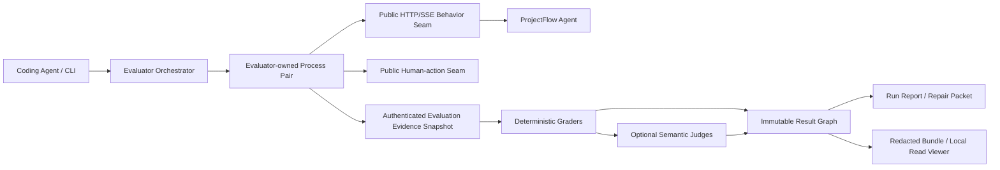

# T46 ProjectFlow Agent Evaluation Lab 实施前对抗性审查

> 日期：2026-07-16  
> 结论：方向成立，但原方案不应作为一个实现任务直接开工；完成本文修正并拆成 tracer-bullet tickets 后，才具备可控实施条件。  
> 范围：仅审查和修正规格，没有实施代码、创建目录结构、安装依赖或修改 runtime。

## 1. 审查对象与方法

本轮重新对照了以下四类证据：

- 用户提供的《Agent 评测：方法论与体系设计》；
- [`agent-evaluation-framework-landscape-2026.md`](../research/agent-evaluation-framework-landscape-2026.md) 中对 Inspect AI、Promptfoo、Pydantic Evals、Braintrust、LangSmith、Phoenix、DeepEval、τ-bench、ToolSandbox、AgentDojo 和 SWE-bench 的调研；
- [`ProjectFlow_Agent_Evaluation_Lab_Spec.md`](ProjectFlow_Agent_Evaluation_Lab_Spec.md) 的原始方案；
- 当前 ProjectFlow 真实代码接缝，包括 public HTTP/SSE runner、fixture provisioner、FastAPI seed/reset 安全条件、sidecar 单一 FastAPI base URL、独立 package 边界和 pinned Node wrapper。

审查没有用“是否符合常见评测平台形态”作为标准，而是从五个不可妥协的问题出发：

1. 它测到的是 ProjectFlow Agent 的真实能力，还是评测器与自身实现的相似度？
2. 它能否在无人值守时保证不破坏开发数据和用户工作区？
3. 它给出的失败原因和修复建议，证据强度是否足以让 Coding Agent 动代码？
4. 它的成本、统计和基线结论是否可证伪，而不是看起来精确？
5. 它能否先交付一个小而可信的闭环，再扩展成完整系统？

## 2. 总体判定

保留的核心判断：

- 必须做 ProjectFlow-native Evaluation Lab，而不是把通用平台当 source of truth；
- public HTTP/SSE 是主行为 seam，状态、不变量、权限和轨迹是硬 oracle；
- LLM Judge 只补语义空白，默认是 soft evidence；
- Coding Agent 通过 CLI + repository-local Skill 操作评测，MCP 后置；
- 结果必须包含 Evidence Ledger、Diagnosis 和 Repair Packet，不能只给分；
- ProjectFlow Agent 的 smoke/full/calibrate 上限分别维持 `$0.10 / $1 / $3`，Coding Agent 成本不计入；
- 无专家、无真实用户时，可以由代理专家研究并提出标准，但不可以把不确定性伪装成金标。

必须修正的总体判断：

- 九个子系统、50–64 个场景、完整 RCA、校准和 Dashboard 不能作为一次实现；
- “临时数据库 + 禁止已知路径”不足以证明隔离安全；
- 确定性失败只能证明症状，不能直接证明根因；
- 历史 baseline 图表不能支持 release regression 因果声明；
- 美元预算在成本 telemetry 缺失时不能声称被强制执行；
- “Robert 是唯一批准者”是 Git 治理规则，不是本地身份认证能力；
- Reference Program 如果同时生成 oracle，会让 evaluator 循环自证；
- Dashboard 的公开展示和私有技术下钻不能共享同一种 artifact/权限模型。

因此，最终架构不变，但交付策略改为：先做 Minimum Trustworthy Loop，再依次加硬领域评测、诊断交接、语义校准和展示成熟度。

## 3. 对抗性发现与修正

| ID | 严重度 | 攻击方式 / 失败模式 | 原方案风险 | 最终修正 |
|---|---|---|---|---|
| A-01 | P0 | Coding Agent 把 #93 当成一次性任务 | 九个子系统同时半成品，无法判断失败在 harness 还是 SUT | #93 改为 umbrella spec；实施前必须拆成五个有 exit gate 的 tracer bullets |
| A-02 | P0 | evaluator 指向开发 SQLite 后调用现有 seed/reset | `development` 环境当前可绕过 admin token，路径黑名单也可被相对路径或 symlink 绕过 | evaluator 创建 temp root + nonce；要求 `APP_ENV=evaluation`、resolved path containment、instance identity 和 token 全部匹配；自主 preset 不接受任意 DB URL |
| A-03 | P0 | 多 worker 共享一个 sidecar，再切换数据库 | 当前 sidecar 每进程只有一个 FastAPI base URL，观察可能交叉污染 | 每个 worker 必须拥有独立 backend/sidecar/database/config pair；不能证明隔离时顺序执行 |
| A-04 | P0 | 从同一业务实现导入 service/verifier 来判同一实现 | implementation bug 可同时存在于 SUT 和 oracle，形成共同失效 | 行为只走 public seam；新增窄化、只读、evaluation-only evidence snapshot；grader 不调用业务实现判断正确性 |
| A-05 | P0 | Reference Program 生成 expected state，再用其验证 Agent | reference 的错误会被定义为真理 | Scenario Contract 先独立声明 goal/invariants；Reference Program 后写，只验证可达性和观察能力 |
| A-06 | P0 | 最早偏离点被写成“确认根因”并生成 fix prompt | Coding Agent 会修改错误模块，甚至扩大回归 | 原因状态分为 observed/localized/intervention-supported/fault-confirmed/unresolved；只有足够局部化且可证伪时发 `fix`，否则发 `investigation` |
| A-07 | P0 | fault injection 直接 patch 当前 worktree | 评测污染被测代码，失败归因和用户改动都不再可信 | 只允许 evaluator-owned adapter/fault profile；fault controls 不可 model-callable，不改用户 worktree |
| A-08 | P1 | SUT 未返回 dollar telemetry 仍显示“未超过 $1” | 预算数字看似精确但不可执行 | `cost_source` 明确 reported/estimated/unknown；unknown 默认拒绝 paid preset，除非显式 override；始终保留 token/call/observation/time ceiling |
| A-09 | P1 | evaluator Judge/simulator 成本不在 SUT cap，又没有自身上限 | calibrate 可在“ProjectFlow Agent <$3”同时产生无界辅助成本 | evaluator model 使用独立 manifest ceiling；Coding Agent 仍 external/not counted |
| A-10 | P1 | 用 stored baseline 与当前 run 比较后宣称回归 | 模型漂移、时间窗口、环境和代码差异混杂 | release claim 要求 baseline/candidate 分离 worktree 与 runtime pair、同 manifest 配对且尽量同窗；不能 pin 模型时标 `model_drift_possible` |
| A-11 | P1 | 把 `pass@1`、`pass^k` 和 k 次全成功混写 | 可靠性指标含义错误，小样本被包装成显著性 | 报 raw trial pass rate 与 empirical all-k；`pass@k` 仅表示至少一次成功；模型化 `pass^k` 必须声明独立性假设；smoke/demo 不做显著性声明 |
| A-12 | P1 | provider retry 与 Agent retry 混为一次成功 | 网络故障重试掩盖第一次 Agent 失败或改变分母 | infra retry 创建新 observation attempt；Agent 内部 retry 单独计量 |
| A-13 | P1 | simulator 泄露 hidden facts 或代替 Agent 完成任务 | evaluator 缺陷被计成 Agent 高分或低分 | 产生 `simulator_error`，不进入 Agent 分母，只在冻结预算内重试 |
| A-14 | P1 | 无 independent Judge 时静默改用同系列模型 | self-preference 变成 hard gate | 降级为 `needs_review`，不允许未经 anchor/stability 证明的语义 hard gate |
| A-15 | P1 | 代码、ADR、schema、产品文档冲突时以现状代码为标准 | bug 被金标合法化 | 产生 `standard_conflict` 并阻止 promotion；必须通过显式标准 diff 解决 |
| A-16 | P1 | 普通 Coding Agent 直接改 active standard 文件 | “Robert only”规则无法靠进程识别本地用户身份 | active standard 进入 Git；promotion 需要显式用户指令、reviewable diff 和 approval record；不声称密码学身份认证 |
| A-17 | P1 | 一个 Dashboard 同时加载 raw 本地 trace 并用于公开演示 | 展示泄露、路径泄露和权限扩大 | 分为 portable redacted bundle 与 loopback-only read viewer；均只读 immutable result graph；run/control 仍在 CLI |
| A-18 | P1 | live run 直接覆盖 accepted baseline | 展示失败或临时结果污染已接受证据 | live preview 原子发布、单独标记，永不覆盖 accepted baseline |
| A-19 | P1 | pseudonym 对所有 bundle 永久稳定 | 可跨演示包关联同一成员/会话 | salt 按 bundle 隔离，只保证 bundle 内稳定 |
| A-20 | P1 | raw artifacts 永久增长或自动过期删除 | 前者耗尽磁盘，后者可能删掉关键证据 | 生成 retention/cleanup preview；V1 不自动删除；失败、needs_review、Repair Packet、promoted baseline 和被引用 bundle 保留 |
| A-21 | P1 | 新 schema 被旧 viewer 静默误读 | Dashboard 与 CLI 对同一 run 给出不同结论 | future schema fail closed；支持版本走显式 migration；artifact 原子写入并校验 hash |
| A-22 | P2 | 单独新增 evaluator package 时顺手迁 root monorepo | 扩大改动面，制造与评测无关的 package 风险 | 只要求逻辑依赖边界并复用 pinned Node wrapper；不要求 root npm workspace |
| A-23 | P2 | Repair Packet 列出“可能文件”却用确定语气 | Coding Agent 把 LLM 猜测当 repo 事实 | code surfaces 默认标 hypothesis；只有 direct component evidence 才升级 |
| A-24 | P2 | 一开始追求 50–64 场景数量 | 产生大量低质量、循环 oracle 和不可维护 fixtures | 50–64 改为成熟目标；每个 slice 只加能证明当前 contract 的最小场景 |

## 4. 修正后的可信架构

### 4.1 行为与证据分离

行为入口保持真实；证据入口保持窄化、只读、带 viewer/instance 边界。grader 读事实，但不通过同一业务 service 计算“应当发生什么”。

### 4.2 隔离不变量

每个 observation worker 必须同时满足：

- evaluator 生成 temp root 和不可预测 nonce；
- database、uploads、config、artifacts 全在 resolved temp root 内；
- backend 使用 `APP_ENV=evaluation`；
- backend 与 sidecar 返回同一 evaluation instance identity；
- destructive fixture call 同时验证 nonce/token 和 path ownership；
- backend/sidecar pair 不与其他 worker 共享 mutable config；
- 任何一项缺失都在模型调用前 fail closed。

“路径不像 production”不是安全证明；“这是 evaluator 自己创建并持有的实例”才是。

### 4.3 Oracle 信任顺序

从最可信到最不可信：

1. 状态约束、权限、隐私、Proposal-Confirm、幂等和终态一致性；
2. 独立声明的 Milestone DAG 与允许/禁止轨迹；
3. metamorphic 与 paired differential signals；
4. 已通过 mutation 的 deterministic graders；
5. 有 anchors、盲化、顺序随机化和 disagreement 的 semantic Judge；
6. 代理专家解释与候选标准提案。

低层证据不能推翻高层 hard gate。代理专家可以产生高质量候选，但没有用户批准就不能改变 active standard。

### 4.4 诊断证据等级

| 状态 | 能说明什么 | Repair Packet |
|---|---|---|
| `observed_failure` | 某个 contract 未满足 | `investigation` |
| `localized_hypothesis` | 证据把候选范围缩到一个或少数模块 | `investigation` |
| `intervention_supported` | 单变量干预重复改变结果，支持该因果解释 | 条件满足时可 `fix` |
| `fault_injection_confirmed` | evaluator 注入的已知故障被正确识别 | 用于校验 RCA，本身通常不要求修产品 |
| `unresolved` | 证据冲突或多因素无法分离 | `investigation` |

`fix` 还必须有能推翻建议的验收测试、保护边界和有效 code fingerprint。否则即使诊断文本很自信，也不能进入自动修复交接。

### 4.5 成本真值

三个 ledger 永不混合：

- `sut_cost`：ProjectFlow Agent；smoke `$0.10`、full `$1`、calibrate `$3`；
- `evaluator_model_cost`：Judge 和 simulator，另设 manifest ceiling；
- `coding_agent_cost`：Codex、Claude Code、Trae 等开发 Agent，external/not counted。

每个 cost bucket 同时记录来源。只有 provider reported 或冻结 pricing table estimate 能执行 dollar stop；unknown 只能执行 token/call/time stop，并必须在报告显著显示 telemetry gap。

## 5. 实施切片与硬停点

### Slice 0：Minimum Trustworthy Loop

只证明一件事：Coding Agent 能安全地通过 CLI/Skill 跑一个真实 public-seam 场景，并拿到可复现的 immutable artifact。没有这一层，任何 Dashboard、RCA 或大规模 suite 都没有可信地基。

### Slice 1：ProjectFlow Hard-Domain Evaluation

加入 state constraints、Milestone DAG、Proposal-Confirm、privacy/visibility、read-only purity、Skill 和 controlled multi-turn。硬 grader 的 declared mutations 必须全部检出，reference path 不得产生 hard false failure。

### Slice 2：Diagnosis and Repair Handoff

加入 evidence-state RCA、fault benchmark、counterfactual、clustering、Repair Packet 和 candidate regression。未知原因只能输出 investigation。

### Slice 3：Calibration and Semantic Quality

加入 anchors、多 Judge 偏差/分歧、standard conflict、candidate standard diff 和 Git-governed promotion。语义门禁在校准证据不足时保持 soft。

### Slice 4：Showcase and Mature Coverage

最后加入两种展示面和扩展 Golden Core。展示消费可信 artifact，不倒逼 grader 为了页面效果改变结论。

具体 exit gates 已写入 canonical spec。实施前下一步应是把这五个 slice 拆成 tickets 和 blocking edges，而不是开始写总框架。

## 6. 对原文章和调研结论的二次判断

原文章最值得保留的是：持续闭环、按 Agent 类型定制、Turn/Session/Trace/Outcome 四层、确定性优先、Judge 校准、RCA 落盘和修复反馈。需要收紧的是：文章在有专家/真实数据的组织环境中，可以把 Human Scorer 当最终兜底；ProjectFlow 目前没有这个条件，因此不能照抄“人审兜底”，只能诚实输出 `needs_review`、`standard_conflict` 和候选标准。

外部框架没有一个应成为 ProjectFlow source of truth：

- Inspect 的 task/log/resume 和 hermetic 思路适合 runner；
- Promptfoo/Braintrust 的 agent-first CLI/MCP 操作面适合交互；
- τ-bench 的 final state 与 repeat reliability 适合任务结果；
- ToolSandbox 的 world snapshot 与 Milestone DAG 适合轨迹；
- AgentDojo 的 utility/security 分离适合 hard gates；
- SWE-bench 的 fixed revision、gold-solution harness validation 适合隔离与 oracle 自检；
- LangSmith/Phoenix 的 trajectory/trace 视图适合参考展示；
- DeepEval 的现成 Judge 指标只能做补充，不能成为高影响门禁。

最终采用组合式本地内核仍是正确选择。对抗审查改变的是可信边界和实施顺序，不是把系统退化成某个现成平台配置文件。

## 7. 残余风险

以下风险无法在实施前完全消除，但已规定处理方式：

- 没有真实用户分布：只声明 offline/synthetic coverage，不声明用户满意度或线上质量；
- 没有独立业务专家：代理专家只提候选，争议标准保持 `needs_review` 或 `standard_conflict`；
- provider 模型不可完全 pin：记录 resolved identity，无法确认时标 `model_drift_possible`；
- SQLite/process 并行会增加复杂度：先顺序执行，隔离证明通过后才开 bounded workers；
- 语义 Judge 会漂移：版本化 prompt/model/anchors，报告 disagreement，不允许静默硬门禁；
- 本地 Git 治理不能鉴别真实自然人：依赖显式用户指令和 reviewable history，不伪装成身份系统。

## 8. Go / No-Go

当前结论：

- **规格修订：Go**；
- **拆分 tickets：Go**；
- **按 #93 一次性实施：No-Go**；
- **未完成 Slice 0 隔离证明前运行 destructive fixture：No-Go**；
- **未完成 fault benchmark 前自动生成 `fix` Repair Packet：No-Go**；
- **未完成 anchor/stability 校准前把 semantic Judge 设为 hard gate：No-Go**；
- **未验证 immutable artifacts 前开始 Dashboard：No-Go**。

本轮到此停止，没有开始实施。
