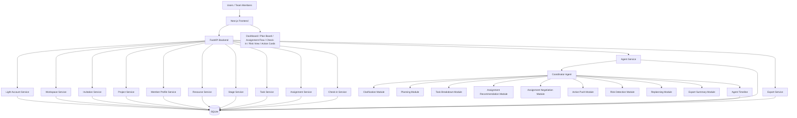
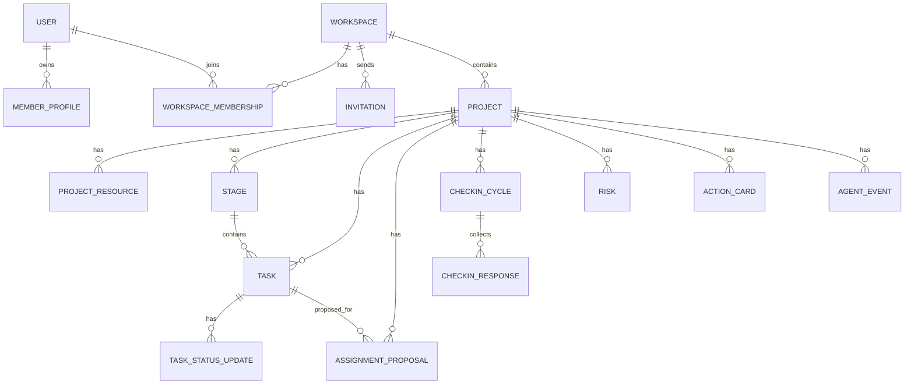
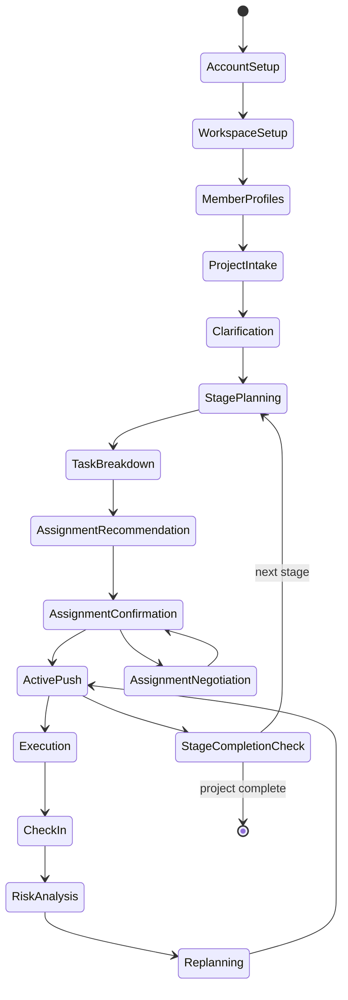

# Technical Design Document: ProjectFlow MVP

## 1. Document Overview

**Project Name:** ProjectFlow  
**Document Type:** Technical Design Document  
**Version:** MVP 0.2  
**Status:** Draft  
**Target Platform:** Web App  
**Primary Milestone:** 2026-06-01 初步 MVP 闭环  
**Demo Milestone:** 2026-06-07 可演示 Demo  
**Review Milestone:** 2026-06-09 线上评审材料  

---

## 1.1 Current Implementation Snapshot

Snapshot date: 2026-05-29.

- Phase 0 / GitHub issue #2 is completed and closed.
- Phase 1 (models) / GitHub issue #3 is completed and closed.
- Phase 2 (core APIs) / GitHub issue #4 is completed and closed.
- Phase 4 (agent infrastructure) / GitHub issue #5 is implemented.
- GitHub issue #6 (Frontend Shell, Onboarding, Workspace, and Intake) is implemented.
- GitHub issue #7 (Planning and Assignment Dashboard UI) is implemented.
- GitHub issue #8 (Assignment, active push, check-in, risk, and replan backend flows) is implemented.
- Implemented: FastAPI scaffold, SQLite configuration skeleton, `GET /api/health`, all 18 domain models with full enum alignment and auto table creation on startup, full CRUD APIs (users, workspaces, invitations, member-profiles, projects, resources, stages, tasks), WorkspaceState assembly endpoint (`GET /api/workspaces/{id}/state`), service layer, Pydantic schemas, agent coordinator infrastructure with structured output validation, mock/OpenAI-compatible LLM adapter, prompt boundaries, JSON repair/retry/template fallback, AgentEvent timeline logging with status, assignment proposal/response/finalize/negotiation APIs, action card APIs, check-in cycle/response APIs, risk APIs, confirmed replan API, agent HTTP endpoints, Next.js app shell with navigation, onboarding flow (account setup + member profile wizard), workspace creation + invite panel, project intake + resource input, planning and assignment dashboard UI, client-side project state composition over implemented endpoints, full domain types and API layer, shadcn/ui components, smoke tests, lint/build/test scripts, README, and runtime ignore rules.
- Frontend routes: `/`, `/onboarding`, `/onboarding/profile`, `/workspaces/new`, `/workspaces/[workspaceId]`, `/projects/new`, `/projects/[projectId]`.
- Not implemented yet: frontend wiring for the issue #8 execution-loop APIs, seed/reset data, export, and complete demo flow.
- Current verification baseline: backend pytest (54 tests), frontend tests (3 tests across 2 files), frontend lint, and frontend build.

---

## 2. Technical Goal

ProjectFlow 的技术目标不是构建完整 SaaS，也不是做一个复杂企业级项目管理平台，而是快速、稳定地实现一个可演示的 **主动推进型项目 Agent 闭环**。

新版 MVP 的核心闭环为：

> 团队成员各自创建账号 → 通过交互收集个人信息 → 团队负责人创建 workspace → 邀请成员加入 → 输入项目信息、想法和相关资料 → Agent 澄清方向并生成方向卡 → 生成阶段计划 → 拆解阶段任务 → 推荐分工 → 成员接受/拒绝/协调确认最终分工 → Agent 主动推进和提醒 → 周期性 check-in / 手动状态更新 → 识别风险 → 动态重排计划 → 输出下一步行动卡片

技术设计必须服务四个目标：

1. **快速交付**：2026-06-01 前跑通初步 MVP，2026-06-07 前形成稳定可演示 Demo。
2. **主动推进可感知**：让评委和用户明确看到 Agent 不只是生成计划，而是在持续推动任务执行。
3. **Agent 可控**：所有 AI 输出必须结构化、可解释、可确认、可回退。
4. **代码可控**：适合 Claude Code / Codex / Cursor 类 AI Coding Agent 执行，避免目录混乱、职责混乱、前后端联调混乱。

---

## 3. Key Product Changes Reflected in This Tech Design

相比上一版 PRD，本版 TECH-DESIGN 重点吸收以下修改：

| PRD Change              | Technical Impact                               |
| ----------------------- | ---------------------------------------------- |
| 成员先创建账号                 | 需要 User / Account 基础模型，但 MVP 不做复杂认证            |
| 团队负责人创建 workspace       | 需要 Workspace 模型，支持单 workspace 演示               |
| 邀请成员加入 workspace        | 需要 Invitation / Membership 轻量模型                |
| 项目可上传相关资料/文档            | 需要 Resource / Attachment 元数据模型，MVP 可先只存文本/文件名  |
| Agent 调取 workspace 成员信息 | Agent 运行必须读取 WorkspaceState，而不是只读 ProjectState |
| 阶段性分工                   | Assignment 必须绑定 stage，每个阶段可重新分工                |
| 成员可接受/拒绝分工              | 需要 AssignmentProposal 和 AssignmentResponse     |
| 拒绝后 Agent 协调交换          | 需要 AssignmentNegotiation / SwapProposal 轻量流程   |
| 周期性 check-in            | 需要 CheckInCycle / CheckInResponse 数据模型         |
| 任务完成后进入下一阶段             | Stage 状态流转需要明确                                 |
| 交互人性、动画流程精美             | 前端需要更强调流程反馈、分发动画、Agent loading 状态              |

---

## 4. Architecture Overview

## 4.1 Recommended Architecture

ProjectFlow MVP 采用：

> **Next.js Frontend + FastAPI Backend + SQLite Local Database + Single Coordinator Agent + Lightweight Workflow / Optional LangGraph**

架构关键词：

- Web 优先
- 本地演示优先
- 单 workspace
- 单项目
- 单 Coordinator Agent
- 状态机控制主流程
- AI 只负责判断与生成
- 确定性代码负责状态、按钮、确认、数据库写入

---

## 4.2 Architecture Diagram



---

## 4.3 Architecture Principles

| Principle                            | Meaning                                                        |
| ------------------------------------ | -------------------------------------------------------------- |
| Single Coordinator Agent             | MVP 不做多 Agent，避免调试复杂、成本上升和演示不稳定                                |
| Workspace-aware Agent                | Agent 读取 workspace、members、project、stage、tasks、check-ins 的统一状态 |
| Workflow First                       | 主流程由确定性状态机控制，Agent 只在指定节点生成建议                                  |
| Human-in-the-loop                    | 方向卡、阶段计划、分工、重排建议必须人工确认后生效                                      |
| AI Suggestions, Deterministic Commit | AI 生成 proposal，后端 service 负责落库和状态迁移                            |
| Structured Output Only               | Agent 输出必须符合 Pydantic schema，不依赖自然语言解析                         |
| Explainability Required              | 分工、拒绝协调、风险、重排、推进建议都必须给 reason                                  |
| Demo First                           | 本地稳定、种子数据、可重置、可录屏优先于正式上线                                       |
| Scope Control                        | 不做多团队、不做复杂权限、不做正式商业部署、不做外部集成                                   |

---

## 5. Tech Stack

| Layer           | Technology                             | Reason                            | Alternative                  | MVP Decision       |
| --------------- | -------------------------------------- | --------------------------------- | ---------------------------- | ------------------ |
| Frontend        | Next.js + React + TypeScript           | 快速构建 Web App，适合 AI Coding，组件生态成熟  | Vite + React / Vue           | Use                |
| Styling         | Tailwind CSS                           | 快速实现统一视觉和响应式布局                    | CSS Modules                  | Use                |
| UI Components   | shadcn/ui + custom components          | 适合快速搭建高质量产品感 Demo                 | Ant Design / MUI             | Use selectively    |
| Animation       | Framer Motion                          | 任务卡分发、状态流转、风险浮现需要精致动效             | CSS transition only          | Use selectively    |
| Backend         | FastAPI                                | Python 生态适合 Agent，接口清晰，自带 OpenAPI | Express / NestJS             | Use                |
| Database        | SQLite                                 | 本地稳定、零配置、适合比赛 Demo                | Supabase / PostgreSQL / JSON | Use                |
| ORM             | SQLModel preferred                     | FastAPI + Pydantic 友好，适合快速建模      | SQLAlchemy raw               | Use                |
| Agent Workflow  | Lightweight State Machine first        | 先保证稳定，避免 LangGraph 学习成本拖慢         | LangGraph                    | Optional after MVP |
| LLM Client      | Provider Adapter                       | 便于 Deepseek/华为云/大模型API聚合平台/国产模型切换 | Hard-coded provider          | Use                |
| Validation      | Pydantic                               | 强制结构化输入输出校验                       | 手写校验                         | Use                |
| File Handling   | Local file metadata + text paste first | MVP 不做复杂文件解析系统                    | Object storage               | Simplified use     |
| Testing         | Pytest + API smoke + manual demo test  | 时间紧，优先主路径验收                       | Full E2E                     | Partial            |
| Deployment      | Localhost first                        | 比赛作品，不强求上线                        | Vercel + Render              | Optional           |
| Version Control | Git                                    | 方便回滚和 AI Coding 协作                | None                         | Required           |

---

## 6. Project Structure

推荐使用前后端分离 monorepo：

```text
projectflow/
├── AGENTS.md
├── CLAUDE.md              # 与 AGENTS.md 内容保持一致；Windows 下不依赖 symlink
├── README.md
├── docs/
│   ├── TECH-DESIGN.md
│   ├── PRD-ProjectFlow-MVP.md
│   ├── PRD-ProjectFlow-Roadmap.md
│   ├── api-contract.md    # current implemented + planned API surface
│   ├── runbook.md         # local setup and verification
│   ├── handoff.md         # current status and next work
│   ├── demo-script.md     # planned
│   ├── seed-scenarios.md  # planned
│   └── ...
│
├── frontend/
│   ├── package.json
│   ├── package-lock.json
│   ├── next.config.mjs
│   ├── eslint.config.mjs
│   ├── vitest.config.ts
│   ├── tsconfig.json
│   ├── src/
│   │   ├── app/
│   │   │   ├── page.tsx
│   │   │   ├── onboarding/page.tsx
│   │   │   ├── workspaces/new/page.tsx
│   │   │   ├── workspaces/[workspaceId]/page.tsx
│   │   │   ├── projects/new/page.tsx
│   │   │   ├── projects/[projectId]/page.tsx
│   │   │   └── layout.tsx
│   │   ├── components/
│   │   │   ├── ui/
│   │   │   ├── onboarding/
│   │   │   ├── workspace/
│   │   │   ├── project/
│   │   │   ├── member/
│   │   │   ├── agent/
│   │   │   ├── stage/
│   │   │   ├── task/
│   │   │   ├── assignment/
│   │   │   ├── checkin/
│   │   │   └── risk/
│   │   ├── lib/
│   │   │   ├── api.ts
│   │   │   ├── types.ts
│   │   │   ├── constants.ts
│   │   │   └── utils.ts
│   │   └── styles/
│   │       └── globals.css
│   └── public/
│
├── backend/
│   ├── pyproject.toml
│   ├── app/
│   │   ├── main.py
│   │   ├── core/
│   │   │   ├── config.py
│   │   │   ├── database.py
│   │   │   ├── errors.py
│   │   │   └── security.py
│   │   ├── models/
│   │   │   ├── user.py
│   │   │   ├── workspace.py
│   │   │   ├── invitation.py
│   │   │   ├── project.py
│   │   │   ├── resource.py
│   │   │   ├── member_profile.py
│   │   │   ├── stage.py
│   │   │   ├── task.py
│   │   │   ├── assignment.py
│   │   │   ├── checkin.py
│   │   │   ├── risk.py
│   │   │   ├── action_card.py
│   │   │   └── timeline.py
│   │   ├── schemas/
│   │   │   ├── user.py
│   │   │   ├── workspace.py
│   │   │   ├── project.py
│   │   │   ├── member_profile.py
│   │   │   ├── task.py
│   │   │   ├── assignment.py
│   │   │   ├── checkin.py
│   │   │   ├── agent.py
│   │   │   └── export.py
│   │   ├── api/
│   │   │   ├── routes_users.py
│   │   │   ├── routes_workspaces.py
│   │   │   ├── routes_invitations.py
│   │   │   ├── routes_projects.py
│   │   │   ├── routes_members.py
│   │   │   ├── routes_tasks.py
│   │   │   ├── routes_assignments.py
│   │   │   ├── routes_checkins.py
│   │   │   ├── routes_agent.py
│   │   │   └── routes_export.py
│   │   ├── services/
│   │   │   ├── user_service.py
│   │   │   ├── workspace_service.py
│   │   │   ├── invitation_service.py
│   │   │   ├── project_service.py
│   │   │   ├── member_service.py
│   │   │   ├── resource_service.py
│   │   │   ├── stage_service.py
│   │   │   ├── task_service.py
│   │   │   ├── assignment_service.py
│   │   │   ├── checkin_service.py
│   │   │   ├── risk_service.py
│   │   │   ├── timeline_service.py
│   │   │   └── export_service.py
│   │   ├── agent/
│   │   │   ├── coordinator.py
│   │   │   ├── workflow.py
│   │   │   ├── prompts.py
│   │   │   ├── llm_client.py
│   │   │   ├── output_schemas.py
│   │   │   └── modules/
│   │   │       ├── clarification.py
│   │   │       ├── planning.py
│   │   │       ├── breakdown.py
│   │   │       ├── assignment_recommendation.py
│   │   │       ├── assignment_negotiation.py
│   │   │       ├── active_push.py
│   │   │       ├── checkin_analysis.py
│   │   │       ├── risk_analysis.py
│   │   │       └── replanning.py
│   │   ├── seed/
│   │   │   ├── demo_projectflow.py
│   │   │   └── demo_blocker_scenario.py
│   │   └── tests/
│   │       ├── test_api_smoke.py
│   │       ├── test_agent_outputs.py
│   │       ├── test_assignment_flow.py
│   │       ├── test_checkin_flow.py
│   │       └── test_risk_replan.py
│   └── data/
│       └── projectflow.sqlite
```

---

## 7. Directory Responsibilities

| Directory                   | Responsibility     | Hard Rules               |
| --------------------------- | ------------------ | ------------------------ |
| `frontend/src/app`          | 页面路由和页面组合          | 不写复杂业务逻辑                 |
| `frontend/src/components`   | UI 组件              | 按业务领域拆分，不混写 API          |
| `frontend/src/lib/api.ts`   | 前端请求封装             | 所有 fetch 统一从这里走          |
| `frontend/src/lib/types.ts` | 前端类型               | 与后端 schema 保持同步          |
| `backend/app/api`           | HTTP route         | 只处理请求/响应，不写业务逻辑          |
| `backend/app/services`      | 确定性业务逻辑            | 落库、状态迁移、校验都在这里           |
| `backend/app/agent`         | Agent 编排和 LLM 调用   | 不直接处理 HTTP，不直接写 DB       |
| `backend/app/models`        | 数据库模型              | 只定义持久化结构                 |
| `backend/app/schemas`       | API / Agent schema | 所有接口必须走 schema           |
| `backend/app/seed`          | Demo 种子数据          | 不混入正式服务逻辑                |
| `docs`                      | 运行、演示、接口说明         | 给团队、AI Coding Agent、评审使用 |

---

## 8. Core Domain Model

## 8.1 Entity Overview



---

## 8.2 User

MVP 不做正式安全认证，但需要轻量账号模型来支撑“成员各自创建账号”。

| Field        | Type            | Description        |
| ------------ | --------------- | ------------------ |
| id           | UUID            | 用户 ID              |
| display_name | string          | 显示名称               |
| email        | string nullable | 可选邮箱，MVP 可为空或 mock |
| avatar_url   | string nullable | 可选头像               |
| created_at   | datetime        | 创建时间               |

MVP 简化规则：

- 可以用 name-only account。
- 不做密码登录。
- 不做 OAuth。
- Demo 中可通过选择用户身份切换视角。

---

## 8.3 Workspace

| Field | Type | Description |
|---|---|---|
| id | UUID | Workspace ID |
| name | string | 团队空间名称 |
| owner_user_id | UUID | 创建者 / 项目负责人 |
| description | text nullable | 团队说明 |
| created_at | datetime | 创建时间 |
| updated_at | datetime | 更新时间 |

---

## 8.4 WorkspaceMembership

| Field | Type | Description |
|---|---|---|
| id | UUID | membership ID |
| workspace_id | UUID | 所属 workspace |
| user_id | UUID | 用户 ID |
| role | enum | owner / member |
| joined_at | datetime | 加入时间 |

---

## 8.5 Invitation

| Field | Type | Description |
|---|---|---|
| id | UUID | 邀请 ID |
| workspace_id | UUID | 所属 workspace |
| invited_name | string | 被邀请人名称 |
| invited_email | string nullable | 可选邮箱 |
| token | string | 邀请 token，MVP 可 mock |
| status | enum | pending / accepted / expired |
| created_at | datetime | 创建时间 |
| accepted_at | datetime nullable | 接受时间 |

MVP 可用“复制邀请链接 / 点击加入”模拟，不做真实邮件发送。

---

## 8.6 MemberProfile

成员个人情况信息独立于具体项目，Agent 可在 workspace 内调取。

| Field | Type | Description |
|---|---|---|
| id | UUID | profile ID |
| user_id | UUID | 用户 ID |
| workspace_id | UUID | 所属 workspace |
| skills | json | 技能列表和熟练度 |
| available_hours_per_week | number | 每周可用时间 |
| role_preference | string | 意向角色 |
| interests | text | 兴趣方向 |
| constraints | text | 时间、设备、能力限制 |
| collaboration_preference | text nullable | 协作偏好 |
| created_at | datetime | 创建时间 |
| updated_at | datetime | 更新时间 |

Example:

```json
{
  "skills": [
    { "name": "frontend", "level": 3 },
    { "name": "design", "level": 4 },
    { "name": "backend", "level": 2 }
  ],
  "available_hours_per_week": 8,
  "role_preference": "UI / frontend",
  "interests": "喜欢做交互和视觉展示",
  "constraints": "周三晚上不可用"
}
```

---

## 8.7 Project

| Field | Type | Description |
|---|---|---|
| id | UUID | 项目 ID |
| workspace_id | UUID | 所属 workspace |
| name | string | 项目名称 |
| idea | text | 原始项目想法 |
| deadline | date | 总截止日期 |
| deliverables | text | 预期交付物 |
| status | enum | draft / active / at_risk / completed |
| current_stage_id | UUID nullable | 当前阶段 |
| direction_card | json nullable | Agent 生成并确认后的方向卡 |
| created_by | UUID | 创建者 |
| created_at | datetime | 创建时间 |
| updated_at | datetime | 更新时间 |

---

## 8.8 ProjectResource

MVP 支持“相关资料/文档”，但不做复杂文档解析。

| Field | Type | Description |
|---|---|---|
| id | UUID | 资料 ID |
| project_id | UUID | 所属项目 |
| type | enum | text_note / file_stub / link |
| title | string | 资料标题 |
| content_text | text nullable | 粘贴文本内容 |
| file_name | string nullable | 文件名，MVP 可只存元数据 |
| url | string nullable | 链接 |
| created_at | datetime | 创建时间 |

MVP 策略：

- 优先支持文本粘贴和链接。
- 文件上传可先做 file metadata，不强制实现 PDF/Word 解析。
- Agent 只读取 `content_text` 和用户手动摘录信息。

---

## 8.9 Stage

| Field | Type | Description |
|---|---|---|
| id | UUID | 阶段 ID |
| project_id | UUID | 所属项目 |
| name | string | 阶段名称 |
| goal | text | 阶段目标 |
| start_date | date | 开始日期 |
| end_date | date | 结束日期 |
| deliverable | text | 阶段交付物 |
| done_criteria | json | 完成标准 |
| status | enum | pending / active / completed / at_risk |
| order_index | int | 阶段顺序 |

Stage 状态规则：

- 同一项目同一时间只有一个 active stage。
- 当前阶段所有 P0 任务完成后，可进入下一阶段。
- 进入新阶段时重新触发阶段性分工推荐。

---

## 8.10 Task

| Field | Type | Description |
|---|---|---|
| id | UUID | 任务 ID |
| project_id | UUID | 所属项目 |
| stage_id | UUID | 所属阶段 |
| title | string | 任务标题 |
| description | text | 任务说明 |
| priority | enum | P0 / P1 / P2 |
| status | enum | not_started / in_progress / done / blocked |
| owner_user_id | UUID nullable | 最终确认负责人 |
| backup_owner_user_id | UUID nullable | 备选负责人 |
| due_date | date | 建议截止日期 |
| estimated_hours | number | 预计耗时 |
| dependency_ids | json | 依赖任务 ID |
| acceptance_criteria | json | 完成标准 |
| can_cut | boolean | 是否可砍 |
| assignment_reason | text nullable | 最终分配理由 |
| created_by_agent | boolean | 是否由 Agent 生成 |
| updated_at | datetime | 更新时间 |

---

## 8.11 AssignmentProposal

分工建议不是直接写入 Task owner，而是先作为 proposal。

| Field | Type | Description |
|---|---|---|
| id | UUID | 分工建议 ID |
| project_id | UUID | 所属项目 |
| stage_id | UUID | 所属阶段 |
| task_id | UUID | 对应任务 |
| recommended_owner_user_id | UUID | 推荐负责人 |
| backup_owner_user_id | UUID nullable | 备选负责人 |
| reason | text | 推荐理由 |
| risk_note | text nullable | 潜在风险 |
| status | enum | proposed / owner_confirmed / owner_rejected / negotiating / finalized |
| created_by_agent | boolean | 是否由 Agent 生成 |
| created_at | datetime | 创建时间 |

---

## 8.12 AssignmentResponse

| Field | Type | Description |
|---|---|---|
| id | UUID | 响应 ID |
| proposal_id | UUID | 对应分工建议 |
| user_id | UUID | 响应人 |
| response | enum | accept / reject |
| preferred_task_id | UUID nullable | 拒绝时希望承担的任务 |
| reason | text nullable | 拒绝或接受说明 |
| created_at | datetime | 创建时间 |

---

## 8.13 AssignmentNegotiation

用于 MVP 中“成员不接受任务，希望换到任务 X，Agent 通知任务 X 当前建议成员确认是否愿意交换”的轻量协调。

| Field | Type | Description |
|---|---|---|
| id | UUID | 协调 ID |
| project_id | UUID | 所属项目 |
| stage_id | UUID | 所属阶段 |
| from_user_id | UUID | 发起拒绝/交换的人 |
| desired_task_id | UUID | 想换到的任务 |
| current_owner_user_id | UUID nullable | 该任务当前建议负责人 |
| status | enum | pending / accepted / declined / resolved |
| agent_message | text | Agent 生成的协调说明 |
| created_at | datetime | 创建时间 |

MVP 不需要做复杂多人拍卖式协调，只做一轮交换确认。

---

## 8.14 CheckInCycle

| Field | Type | Description |
|---|---|---|
| id | UUID | check-in 周期 ID |
| project_id | UUID | 所属项目 |
| stage_id | UUID | 当前阶段 |
| cadence_days | int | 每 x 天一次 |
| start_date | date | 开始日期 |
| next_due_date | date | 下一次 check-in 日期 |
| status | enum | active / paused / completed |
| created_by_user_id | UUID | 设置人，通常是负责人 |
| created_at | datetime | 创建时间 |

---

## 8.15 CheckInResponse

| Field | Type | Description |
|---|---|---|
| id | UUID | 回答 ID |
| cycle_id | UUID | 所属周期 |
| project_id | UUID | 所属项目 |
| stage_id | UUID | 当前阶段 |
| user_id | UUID | 成员 |
| task_id | UUID nullable | 关联任务 |
| what_done | text | 今天/本周期做了什么，一句话 |
| blocker | text nullable | 卡点 |
| available_hours_next_cycle | number nullable | 下周期可投入时间 |
| mood_or_confidence | enum nullable | low / medium / high |
| created_at | datetime | 提交时间 |

---

## 8.16 TaskStatusUpdate

| Field | Type | Description |
|---|---|---|
| id | UUID | 状态更新 ID |
| task_id | UUID | 对应任务 |
| user_id | UUID | 更新人 |
| status | enum | not_started / in_progress / done / blocked |
| progress_note | text nullable | 进度说明 |
| blocker | text nullable | 阻塞问题 |
| available_hours_change | number nullable | 可用时间变化 |
| created_at | datetime | 更新时间 |

---

## 8.17 Risk

| Field | Type | Description |
|---|---|---|
| id | UUID | 风险 ID |
| project_id | UUID | 所属项目 |
| stage_id | UUID nullable | 关联阶段 |
| task_id | UUID nullable | 关联任务 |
| type | enum | deadline / dependency / workload / scope / review / assignment / checkin |
| severity | enum | low / medium / high |
| title | string | 风险标题 |
| description | text | 风险说明 |
| evidence | json | 判断依据 |
| recommendation | text | 建议动作 |
| status | enum | open / accepted / ignored / resolved |
| created_by_agent | boolean | 是否由 Agent 生成 |
| created_at | datetime | 创建时间 |

---

## 8.18 ActionCard

| Field | Type | Description |
|---|---|---|
| id | UUID | 行动卡 ID |
| project_id | UUID | 所属项目 |
| stage_id | UUID nullable | 阶段 |
| user_id | UUID nullable | 目标成员，空表示团队卡片 |
| task_id | UUID nullable | 关联任务 |
| type | enum | personal_task / team_next_step / reminder / risk_action / kickoff_tip / checkin_prompt / assignment_request |
| title | string | 卡片标题 |
| content | text | 卡片内容 |
| reason | text | 为什么现在推送 |
| due_date | date nullable | 建议完成时间 |
| status | enum | active / done / dismissed |
| created_by_agent | boolean | 是否由 Agent 生成 |
| created_at | datetime | 创建时间 |

---

## 8.19 AgentEvent / Timeline

| Field | Type | Description |
|---|---|---|
| id | UUID | 事件 ID |
| project_id | UUID | 所属项目 |
| workspace_id | UUID | 所属 workspace |
| event_type | enum | clarify / plan / breakdown / assign / negotiate / push / checkin / risk / replan / export |
| input_snapshot | json | 输入状态快照 |
| output_snapshot | json | Agent 输出快照 |
| reasoning_summary | text | 可展示的简短判断理由 |
| user_confirmed | boolean | 用户是否确认 |
| created_at | datetime | 创建时间 |

注意：`reasoning_summary` 只存给用户看的简短理由，不存模型内部推理链。

---

## 9. State Management

## 9.1 Backend State

SQLite 是唯一权威状态来源。

核心状态对象：

```text
WorkspaceState = {
  workspace,
  users,
  memberships,
  member_profiles,
  project,
  resources,
  stages,
  tasks,
  assignment_proposals,
  assignment_responses,
  assignment_negotiations,
  checkin_cycles,
  checkin_responses,
  task_status_updates,
  risks,
  action_cards,
  agent_timeline
}
```

Agent 每次运行必须读取最新 WorkspaceState。

---

## 9.2 Frontend State

前端只保存 UI 临时状态：

- 当前用户视角
- 当前 workspace
- 当前 project
- 当前 dashboard tab
- 表单草稿
- loading / streaming 状态
- toast / dialog 状态
- 动画状态

前端不自行推导复杂项目风险，也不直接修改任务 owner。所有关键变更通过 API。

---

## 9.3 State Transition Rules

| State Area | Rule                                            |
| ---------- | ----------------------------------------------- |
| Workspace  | MVP 只有一个 workspace，但数据模型保留 workspace_id         |
| Account    | MVP 可 mock 登录 / 选择身份，不做密码认证                     |
| Project    | 创建后进入 draft，方向卡确认后进入 active                     |
| Stage      | 同一项目同一时间只有一个 active stage                       |
| Assignment | AI 生成 proposal，成员响应后，负责人确认 finalized            |
| Task Owner | 只有 finalized assignment 才能写入 task.owner_user_id |
| Check-in   | Check-in 只收集状态，不自动改任务 owner                     |
| Risk       | Risk 可由 Agent 生成，但是否采纳建议需用户确认                   |
| Replan     | Replan 是 proposal，确认后才改任务/阶段                    |
| Timeline   | 每次 Agent 运行都必须记录事件                              |

---

## 10. Agent Architecture

## 10.1 Agent Pattern

MVP 使用：

> **Single Coordinator Agent + Workflow-controlled Modules**

不做：

- 多 Agent 对话
- CrewAI crew
- AutoGen 群聊
- Supervisor + Specialist Agents
- 自动化无确认修改

采用：

- Coordinator Agent 统一读取 WorkspaceState。
- Workflow 决定当前该运行哪个模块。
- Module 输出结构化 proposal。
- Service 层负责确认、落库和状态迁移。

---

## 10.2 Agent Workflow



---

## 10.3 Agent Modules

| Module                    | Input                                      | Output                                | Writes DB?              |
| ------------------------- | ------------------------------------------ | ------------------------------------- | ----------------------- |
| Clarification             | project idea, resources, workspace members | questions, direction card             | after confirm           |
| Planning                  | direction card, deadline, deliverables     | stages, milestones                    | after confirm           |
| Breakdown                 | stages, deliverables, resources            | tasks, dependencies, priorities       | after confirm           |
| Assignment Recommendation | tasks, member profiles                     | assignment proposals                  | yes as proposals        |
| Assignment Negotiation    | rejection, desired task, current proposal  | swap proposal / coordination message  | yes as negotiation      |
| Active Push               | project state, stage, assignments, tasks   | action cards, reminders, kickoff tips | yes                     |
| Check-in Analysis         | check-in responses                         | status summary, possible risks        | yes as timeline / risks |
| Risk Analysis             | tasks, check-ins, deadlines, assignments   | risk cards                            | yes                     |
| Replanning                | risks, project state                       | replan proposal                       | after confirm           |
| Export                    | full state                                 | review summary markdown               | optional                |

---

## 10.4 Structured Output Schemas

### Clarification Output

```json
{
  "questions": [
    {
      "id": "q1",
      "question": "string",
      "why_it_matters": "string"
    }
  ],
  "direction_card": {
    "problem": "string",
    "target_users": "string",
    "core_value": "string",
    "deliverables": ["string"],
    "constraints": ["string"],
    "out_of_scope": ["string"],
    "initial_risks": ["string"]
  }
}
```

### Planning Output

```json
{
  "stages": [
    {
      "name": "string",
      "goal": "string",
      "start_date": "YYYY-MM-DD",
      "end_date": "YYYY-MM-DD",
      "deliverable": "string",
      "done_criteria": ["string"]
    }
  ]
}
```

### Task Breakdown Output

```json
{
  "tasks": [
    {
      "stage_name": "string",
      "title": "string",
      "description": "string",
      "priority": "P0 | P1 | P2",
      "estimated_hours": 0,
      "due_date": "YYYY-MM-DD",
      "dependencies": ["string"],
      "acceptance_criteria": ["string"],
      "can_cut": false
    }
  ]
}
```

### Assignment Recommendation Output

```json
{
  "assignments": [
    {
      "task_title": "string",
      "recommended_owner_user_id": "uuid",
      "backup_owner_user_id": "uuid",
      "reason": "string",
      "risk_note": "string"
    }
  ]
}
```

### Assignment Negotiation Output

```json
{
  "negotiation_message": "string",
  "desired_task_id": "uuid",
  "current_owner_user_id": "uuid",
  "swap_options": [
    {
      "option_type": "swap | split | keep_original | manual_decision",
      "description": "string",
      "reason": "string"
    }
  ]
}
```

### Active Push Output

```json
{
  "action_cards": [
    {
      "target_user_id": "uuid | null",
      "task_id": "uuid | null",
      "type": "personal_task | team_next_step | reminder | risk_action | kickoff_tip | checkin_prompt | assignment_request",
      "title": "string",
      "content": "string",
      "reason": "string",
      "due_date": "YYYY-MM-DD | null"
    }
  ]
}
```

### Risk Output

```json
{
  "risks": [
    {
      "type": "deadline | dependency | workload | scope | review | assignment | checkin",
      "severity": "low | medium | high",
      "title": "string",
      "description": "string",
      "evidence": ["string"],
      "recommendation": "string"
    }
  ]
}
```

### Replanning Output

```json
{
  "summary": "string",
  "changes": [
    {
      "change_type": "change_owner | cut_scope | delay_task | reprioritize | split_task | move_to_next_stage",
      "target_task_id": "uuid",
      "before": "string",
      "after": "string",
      "reason": "string"
    }
  ],
  "next_actions": [
    {
      "title": "string",
      "owner_user_id": "uuid | null",
      "due_date": "YYYY-MM-DD",
      "reason": "string"
    }
  ]
}
```

---

## 10.5 Agent Stability Rules

Agent 必须遵守：

1. 不直接写数据库，所有写入通过 service 层。
2. 不直接修改 finalized assignment。
3. 不直接修改 task owner，必须通过 confirm endpoint。
4. 不输出无法解析的自然语言作为核心数据。
5. 不凭空发明不存在的用户、任务、阶段。
6. 所有建议必须包含 reason。
7. 高影响变更必须等待人工确认。
8. 文件资料只使用用户提供的文本或元数据，不假装读取了未解析文件。
9. 输出失败必须 fallback。
10. 不承诺自动解决人际矛盾、真实执行力和态度问题，只能暴露和缓解风险。

---

## 11. API Design

Base URL:

```text
http://localhost:8000/api
```

---

## 11.1 Health API

```http
GET /api/health
```

Response:

```json
{
  "status": "ok",
  "service": "projectflow-backend"
}
```

---

## 11.2 Users API

### Create Lightweight User

```http
POST /api/users
```

Request:

```json
{
  "display_name": "小林",
  "email": "optional@example.com"
}
```

Response:

```json
{
  "user_id": "uuid",
  "display_name": "小林"
}
```

### Select Demo User

```http
POST /api/users/select-demo-user
```

Request:

```json
{
  "user_id": "uuid"
}
```

MVP 用于前端切换身份，不做真实登录。

---

## 11.3 Workspace API

### Create Workspace

```http
POST /api/workspaces
```

Request:

```json
{
  "name": "ProjectFlow Team",
  "owner_user_id": "uuid",
  "description": "AI Agent 工程训练营项目团队"
}
```

Response:

```json
{
  "workspace_id": "uuid",
  "name": "ProjectFlow Team"
}
```

### Get Workspace State

```http
GET /api/workspaces/{workspace_id}/state
```

Response:

```json
{
  "workspace": {},
  "users": [],
  "memberships": [],
  "member_profiles": [],
  "projects": []
}
```

---

## 11.4 Invitation API

### Create Invitation

```http
POST /api/workspaces/{workspace_id}/invitations
```

Request:

```json
{
  "invited_name": "小王",
  "invited_email": null
}
```

Response:

```json
{
  "invitation_id": "uuid",
  "invite_link": "http://localhost:3000/invite/mock-token"
}
```

### Accept Invitation

```http
POST /api/invitations/{token}/accept
```

Request:

```json
{
  "user_id": "uuid"
}
```

---

## 11.5 Member Profile API

### Create / Update Member Profile

```http
PUT /api/workspaces/{workspace_id}/members/{user_id}/profile
```

Request:

```json
{
  "skills": [
    { "name": "frontend", "level": 3 },
    { "name": "design", "level": 4 }
  ],
  "available_hours_per_week": 8,
  "role_preference": "UI / frontend",
  "interests": "喜欢做交互和视觉展示",
  "constraints": "周三晚上不可用"
}
```

---

## 11.6 Project API

### Create Project

```http
POST /api/workspaces/{workspace_id}/projects
```

Request:

```json
{
  "name": "ProjectFlow",
  "idea": "帮助大学生项目小队推进项目",
  "deadline": "2026-06-09",
  "deliverables": "MVP demo, README, demo video",
  "created_by": "uuid"
}
```

### Get Project State

```http
GET /api/projects/{project_id}/state
```

Response:

```json
{
  "workspace": {},
  "project": {},
  "resources": [],
  "members": [],
  "member_profiles": [],
  "stages": [],
  "tasks": [],
  "assignment_proposals": [],
  "checkins": [],
  "risks": [],
  "action_cards": [],
  "timeline": []
}
```

---

## 11.7 Project Resource API

### Add Resource

```http
POST /api/projects/{project_id}/resources
```

Request:

```json
{
  "type": "text_note",
  "title": "项目背景资料",
  "content_text": "这里粘贴调研摘要或项目资料",
  "url": null,
  "file_name": null
}
```

MVP 不强制做文件解析。文件上传可先存 metadata。

---

## 11.8 Agent API

### Run Clarification

```http
POST /api/agent/clarify
```

### Generate Stage Plan

```http
POST /api/agent/plan
```

### Generate Task Breakdown

```http
POST /api/agent/breakdown
```

### Generate Assignment Recommendation

```http
POST /api/agent/assign
```

### Generate Active Push Cards

```http
POST /api/agent/active-push
```

### Analyze Check-ins

```http
POST /api/agent/check-in-analysis
```

### Run Risk Analysis

```http
POST /api/agent/risk-analysis
```

### Generate Replan Proposal

```http
POST /api/agent/replan
```

Request:

```json
{
  "workspace_id": "uuid"
}
```

All agent responses include structured persistence metadata:

```json
{
  "event_type": "assign",
  "status": "success",
  "attempts": 1,
  "used_fallback": false,
  "output": {},
  "created_ids": ["uuid"]
}
```

---

## 11.9 Planned Generic Confirmation API

```http
POST /api/projects/{project_id}/confirm
```

Request:

```json
{
  "timeline_event_id": "uuid",
  "confirm_type": "direction_card | plan | tasks | assignments | replan",
  "accepted": true,
  "confirmed_by": "uuid"
}
```

---

## 11.10 Assignment API

### Create Assignment Proposal

```http
POST /api/assignment-proposals
```

### Get Assignment Proposal

```http
GET /api/assignment-proposals/{proposal_id}
```

### List Project Assignment Proposals

```http
GET /api/projects/{project_id}/assignment-proposals
```

### Respond to Assignment Proposal

```http
POST /api/assignment-proposals/{proposal_id}/responses
```

Request:

```json
{
  "user_id": "uuid",
  "response": "reject",
  "preferred_task_id": "uuid",
  "reason": "我更想做前端交互，而且这个任务更匹配我的能力"
}
```

### Start Assignment Negotiation

```http
POST /api/assignment-negotiations
```

Request:

```json
{
  "project_id": "uuid",
  "stage_id": "uuid",
  "from_user_id": "uuid",
  "desired_task_id": "uuid",
  "current_owner_user_id": "uuid | null",
  "agent_message": "建议交换任务，因为..."
}
```

### Finalize Assignment Proposal

```http
POST /api/assignment-proposals/{proposal_id}/finalize
```

No request body. The service only writes `task.owner_user_id` after the proposal is `owner_confirmed`.

---

## 11.11 Check-in API

### Create Check-in Cycle

```http
POST /api/checkin-cycles
```

Request:

```json
{
  "project_id": "uuid",
  "stage_id": "uuid",
  "cadence_days": 2,
  "start_date": "2026-05-29",
  "created_by_user_id": "uuid"
}
```

### List Project Check-in Cycles

```http
GET /api/projects/{project_id}/checkin-cycles
```

### Submit Check-in Response

```http
POST /api/checkin-cycles/{cycle_id}/responses
```

Request:

```json
{
  "user_id": "uuid",
  "task_id": "uuid",
  "what_done": "完成了首页任务卡组件初版",
  "blocker": "还不确定接口字段",
  "available_hours_next_cycle": 3,
  "mood_or_confidence": "medium"
}
```

### List Check-in Responses

```http
GET /api/checkin-cycles/{cycle_id}/responses
```

---

## 11.12 Task API

### Update Task Status

```http
POST /api/tasks/{task_id}/status-updates
```

Request:

```json
{
  "user_id": "uuid",
  "status": "blocked",
  "progress_note": "后端接口还没联通",
  "blocker": "缺少 API schema",
  "available_hours_change": -3
}
```

---

## 11.13 Action Card API

### Create Action Card

```http
POST /api/action-cards
```

### List Project Action Cards

```http
GET /api/projects/{project_id}/action-cards
```

---

## 11.14 Risk API

### Create Risk

```http
POST /api/risks
```

### List Project Risks

```http
GET /api/projects/{project_id}/risks
```

---

## 11.15 Replan API

### Confirm Replan

```http
POST /api/replans/confirm
```

The confirm endpoint applies accepted task changes only after explicit confirmation.

---

## 11.16 Planned Export API

```http
POST /api/projects/{project_id}/export/review-summary
```

Response:

```json
{
  "markdown": "# ProjectFlow 中期评审摘要..."
}
```

---

## 12. Frontend Design

## 12.1 Main Screens

| Screen | Route | Purpose |
|---|---|---|
| Home | `/` | 产品入口和 demo 项目入口 |
| Account Setup | `/onboarding` | 创建轻量账号，填写基本名称 |
| Member Profile | `/onboarding/profile` | 交互式填写技能、时间、意向、限制 |
| New Workspace | `/workspaces/new` | 负责人创建 workspace |
| Workspace Dashboard | `/workspaces/[workspaceId]` | 成员、邀请、项目入口 |
| New Project | `/projects/new` | 输入项目想法、交付物、资料 |
| Project Dashboard | `/projects/[projectId]` | 当前项目总览 |
| Clarification View | Dashboard tab | 澄清问题和方向卡 |
| Plan Board | Dashboard tab | 阶段计划和任务树 |
| Assignment Flow | Dashboard tab | 推荐、接受/拒绝、交换、最终确认 |
| Action Cards | Dashboard tab | 个人任务卡、团队下一步、启动建议 |
| Check-in View | Dashboard tab | 周期性状态提交 |
| Risk & Replan | Dashboard tab | 风险卡和动态重排 |
| Agent Timeline | Dashboard tab | Agent 决策日志 |
| Summary Export | Dashboard tab | 导出评审摘要 |

---

## 12.2 Component Plan

| Component | Description |
|---|---|
| `AccountSetupForm` | 轻量账号创建 |
| `MemberProfileWizard` | 交互式收集成员技能、时间、意向 |
| `WorkspaceCreateForm` | 创建 workspace |
| `InviteMemberPanel` | 邀请成员加入 |
| `ProjectIntakeForm` | 项目信息、交付物、资料输入 |
| `ResourceInputPanel` | 粘贴资料、链接、文件 metadata |
| `DirectionCard` | 方向卡展示与确认 |
| `StageTimeline` | 阶段计划展示 |
| `TaskTree` | 任务树和依赖展示 |
| `AssignmentProposalCard` | 单个任务分工建议 |
| `AssignmentResponsePanel` | 接受/拒绝/选择意向任务 |
| `AssignmentNegotiationPanel` | 交换协调展示 |
| `FinalAssignmentBoard` | 最终分工确认 |
| `ActionCardList` | 主动推进卡片 |
| `CheckInForm` | 周期性 check-in 表单 |
| `RiskCard` | 风险等级、证据、建议 |
| `ReplanDiff` | 重排前后变化 |
| `AgentTimeline` | 证据-判断-动作日志 |
| `AgentLoadingPanel` | AI 生成过程可视化 |
| `DemoResetButton` | 重置种子数据 |

Current implementation note: GitHub issue #7 implements the first project dashboard slice with `ProjectDashboard`, `DirectionCardPanel`, `StagePlanBoard`, `TaskBreakdownBoard`, and `AssignmentFlowPanel`. GitHub issue #8 implements the backend routes and services for agent execution, assignment responses/finalization/negotiation, action cards, check-ins, risks, and confirmed replans. The dashboard still needs frontend wiring for `ActionCardList`, `CheckInForm`, `RiskCard`, `ReplanDiff`, `AgentTimeline`, `AgentLoadingPanel`, and `DemoResetButton`.

---

## 12.3 UI / UX Requirements

视觉方向：

> 清晰、冷静、可靠、轻量、有推进感，同时交互人性、动画流程精美。

关键 UI 原则：

1. **Dashboard 第一眼要回答“现在该做什么”**，不能只是任务列表。
2. **成员任务卡要像被 Agent 主动分发到个人手里**，建议加入轻量分发动画。
3. **Agent 输出过程必须可视化**，例如“正在读取成员信息 → 正在分析任务依赖 → 正在生成分工建议”。
4. **分工确认流程要清楚**：推荐 → 成员接受/拒绝 → 协调 → 最终确认。
5. **Check-in 要轻量**：三问即可，不要做成复杂日报系统。
6. **风险卡必须显示证据**：不能只有“有风险”三个字。
7. **重排建议要显示 before/after**：方便评委理解 Agent 的调整能力。
8. **Demo 主路径 5 分钟内讲完**。

---

## 13. Error Handling

## 13.1 Backend Error Types

| Error Type          | Example          | Handling                       |
| ------------------- | ---------------- | ------------------------------ |
| ValidationError     | 缺少 deadline      | 400 + 字段提示                     |
| NotFoundError       | project_id 不存在   | 404                            |
| PermissionLiteError | 非 workspace 成员访问 | 403，MVP 轻量处理                   |
| AgentOutputError    | LLM 输出无法解析       | retry + fallback + timeline 记录 |
| AgentTimeoutError   | LLM 超时           | 返回可重试状态                        |
| ConflictError       | 确认过期 proposal    | 要求刷新状态                         |
| DatabaseError       | SQLite 写入失败      | 500 + 错误日志                     |

---

## 13.2 Agent Fallback Strategy

当 Agent 输出失败时：

1. 尝试 JSON 修复。
2. 失败后 retry 一次。
3. 仍失败则返回模板化 fallback。
4. 前端提示“AI 输出不稳定，已生成基础建议”。
5. Timeline 记录失败事件。

Fallback 示例：

```json
{
  "risks": [
    {
      "type": "review",
      "severity": "medium",
      "title": "当前状态需要人工检查",
      "description": "系统未能稳定生成完整风险分析，请检查当前阶段 P0 任务和成员 check-in。",
      "evidence": ["Agent output parsing failed"],
      "recommendation": "请先查看未完成的 P0 任务，并手动确认下一步。"
    }
  ]
}
```

---

## 13.3 Frontend Error States

每个核心页面必须有：

- Loading state
- Empty state
- Error state
- Retry button
- Demo reset option
- Agent generation progress

---

## 14. Security & Privacy

MVP 阶段不重点考虑完整隐私和安全，但仍需满足基础工程要求。

## 14.1 MVP Security Rules

- 不存真实敏感个人信息。
- 不做正式密码系统。
- 不做 OAuth。
- 不做复杂 RBAC。
- 本地 SQLite 仅用于演示数据。
- API key 必须放 `.env`，不能提交 Git。
- 前端不能直接调用 LLM API。
- 所有 LLM 调用必须经过后端。
- 文件上传 MVP 不处理真实敏感资料。

## 14.2 Lightweight Authorization

MVP 可以使用轻量校验：

- 请求中传 `current_user_id`。
- 后端检查该用户是否属于 workspace。
- owner 才能 finalize assignment / confirm replan。

不做正式 JWT。后续上线再补。

## 14.3 Environment Variables

```text
APP_ENV=development
DATABASE_URL=sqlite:///./data/projectflow.sqlite
LLM_PROVIDER=mock
LLM_API_KEY=xxx
LLM_BASE_URL=https://api.openai.com/v1
LLM_MODEL=gpt-4o-mini
NEXT_PUBLIC_API_BASE_URL=http://localhost:8000/api
```

`APP_ENV`、`DATABASE_URL`、`LLM_PROVIDER`、`LLM_API_KEY`、`LLM_BASE_URL`、`LLM_MODEL` 已由后端配置读取。`LLM_PROVIDER` 默认 `mock`；真实 LLM 接入时设置为 `openai` 或 `openai-compatible`，并把 `LLM_API_KEY` 放在 `.env`。`NEXT_PUBLIC_API_BASE_URL` 是前端可选变量，不配置时默认 `http://localhost:8000/api`。

## 14.4 Git Ignore Rules

必须忽略：

```text
.env
.env.*
*.sqlite
*.sqlite3
backend/data/
node_modules/
.venv/
__pycache__/
frontend/.next/
frontend/out/
frontend/dist/
.pytest_cache/
.mypy_cache/
.ruff_cache/
```

---

## 15. Testing Strategy

## 15.1 Testing Priorities

| Priority | Test Type | Scope |
|---|---|---|
| P0 | Manual demo test | 完整主流程 |
| P0 | API smoke test | 关键接口可调用 |
| P0 | Agent schema test | Agent 输出符合 schema |
| P0 | Assignment flow test | 推荐、拒绝、协调、最终确认 |
| P0 | Check-in flow test | 周期创建、成员提交、风险触发 |
| P1 | Service unit test | 状态迁移、风险规则 |
| P1 | Frontend UI check | 核心页面状态 |
| P2 | Full E2E | 后续再补 |

---

## 15.2 Critical Test Cases

### Test Case 1: Account → Workspace → Member Profile

Steps:

1. 创建 5–6 个轻量用户。
2. 创建 workspace。
3. 邀请成员加入。
4. 每个成员填写 profile。

Expected:

- WorkspaceState 中能看到成员和 profile。
- Agent 能读取成员信息。

---

### Test Case 2: Project Intake → Direction → Plan

Steps:

1. 创建项目。
2. 输入 idea、deadline、deliverables、resources。
3. 运行 clarification。
4. 确认 direction card。
5. 生成 stage plan。

Expected:

- 方向卡包含目标、用户、边界、风险。
- 生成 3–5 个阶段。
- Timeline 记录 clarify / plan。

---

### Test Case 3: Task Breakdown → Assignment Recommendation

Steps:

1. 对当前阶段生成任务。
2. 运行 assignment recommendation。
3. 查看每个任务 owner、backup owner、reason。

Expected:

- 每个 P0 任务都有推荐 owner。
- 推荐理由引用成员技能/时间/意向。
- 分工没有直接 finalized。

---

### Test Case 4: Assignment Reject and Swap

Steps:

1. 成员 A 拒绝任务。
2. 成员 A 选择希望承担任务 X。
3. Agent 生成协调说明。
4. 当前任务 X 推荐成员 B 接受或拒绝交换。
5. 负责人最终确认分工。

Expected:

- AssignmentProposal 状态正确变化。
- AssignmentNegotiation 被记录。
- 最终确认后 Task owner 才更新。

---

### Test Case 5: Active Push

Steps:

1. 阶段分工 finalized。
2. 运行 active push。

Expected:

- 每个成员看到个人任务卡。
- 团队看到下一步行动卡。
- 每张卡都有 reason、due date、启动建议。

---

### Test Case 6: Check-in → Risk → Replan

Steps:

1. 创建 2 天一次 check-in cycle。
2. 成员提交 check-in。
3. 某成员填写 blocker。
4. 某成员可用时间下降。
5. 运行 risk analysis。
6. 运行 replan。

Expected:

- 生成 deadline / workload / checkin 等风险。
- Replan 包含 before/after。
- Replan 不自动生效。

---

### Test Case 7: Stage Completion and Next Stage Assignment

Steps:

1. 当前阶段 P0 任务全部 done。
2. 标记 stage completed。
3. 进入下一阶段。
4. 重新生成阶段性分工。

Expected:

- 只有一个 active stage。
- 新阶段触发新的 assignment proposal。

---

## 16. Development Plan

## 16.1 Phase 0: Guardrails & Setup

Output:

- `AGENTS.md`
- Monorepo 初始化
- 前后端可启动
- SQLite 初始化
- `/api/health`

Acceptance:

- 前端 localhost:3000 可打开。
- 后端 localhost:8000 可访问。
- Git 初始化完成。
- AI Coding Agent 有明确目录规则。

Current status:

- Completed on 2026-05-28 via GitHub issue #2.
- Verified with backend pytest, frontend test, frontend lint, frontend build, and `npm audit --omit=dev`.
- Remaining Phase 0 cleanup is documentation maintenance only; implementation can proceed to Phase 1 domain models.

---

## 16.2 Phase 1: Account / Workspace / Member Profile

Output:

- User 模型
- Workspace 模型
- Invitation 模型
- MemberProfile 模型
- 轻量身份切换 UI
- 成员信息交互式填写 UI

Acceptance:

- 可以创建账号。
- 可以创建 workspace。
- 可以邀请/加入成员。
- 可以填写成员技能、时间、意向、限制。

Current status:

- Domain models (User, Workspace, WorkspaceMembership, Invitation, MemberProfile, Project, ProjectResource, Stage, Task, AssignmentProposal, AssignmentResponse, AssignmentNegotiation, CheckInCycle, CheckInResponse, TaskStatusUpdate, Risk, ActionCard, AgentEvent) completed on 2026-05-29 via GitHub issue #3.
- Core CRUD APIs and WorkspaceState endpoint completed on 2026-05-29 via GitHub issue #4.
- Frontend shell, onboarding, workspace, and project intake UI implemented on 2026-05-29 via GitHub issue #6.
- Planning and assignment dashboard UI implemented on 2026-05-29 via GitHub issue #7.
- Assignment, active push, check-in, risk, and replan backend flows implemented on 2026-05-29 via GitHub issue #8.

---

## 16.3 Phase 2: Project Intake + Resources

Output:

- Project 模型
- ProjectResource 模型
- Project Intake 页面
- 资料文本/链接输入

Acceptance:

- 负责人可以创建项目。
- 可以输入项目想法、截止日期、交付物、资料。
- 可以读取完整 ProjectState。

---

## 16.4 Phase 3: Agent Core Flow

Output:

- LLM client
- Coordinator Agent
- Clarification module
- Planning module
- Breakdown module
- Agent schema validation

Acceptance:

- 能生成澄清问题和方向卡。
- 能生成阶段计划。
- 能拆解阶段任务。
- Agent 输出可解析、可保存、可确认。

---

## 16.5 Phase 4: Assignment Flow

Output:

- AssignmentProposal
- AssignmentResponse
- AssignmentNegotiation
- Assignment recommendation module
- Assignment UI

Acceptance:

- 能推荐分工。
- 成员能接受/拒绝。
- 拒绝后能表达期望任务。
- Agent 能生成交换协调建议。
- 负责人能 finalize 分工。

---

## 16.6 Phase 5: Active Push + Check-in

Output:

- ActionCard
- Active Push module
- CheckInCycle
- CheckInResponse
- Check-in UI

Acceptance:

- 每个成员能看到任务卡。
- 负责人能设置 check-in cadence。
- 成员能提交 check-in。
- Agent 能基于 check-in 给出推进建议。

---

## 16.7 Phase 6: Risk + Replan + Timeline

Output:

- Risk Detection
- Replanning Proposal
- Agent Timeline
- Replan Diff UI

Acceptance:

- blocker / 可用时间下降能触发风险。
- Agent 能给出动态重排建议。
- 重排建议包含 before/after 和 reason。
- Timeline 展示证据-判断-动作。

---

## 16.8 Phase 7: Demo Polish

Output:

- Demo seed data
- Reset button
- 任务卡分发动画
- Agent loading panel
- Review summary export
- README / runbook

Acceptance:

- 5 分钟内完整跑通 demo。
- 本地稳定不卡死。
- 关键场景有截图/录屏兜底。

---

## 17. AI Coding Agent Rules

这些规则必须写入 `AGENTS.md`。

## 17.1 General Rules

- 不允许未经确认更换技术栈。
- 不允许跳过 `AGENTS.md` 约束直接开写。
- 不允许把业务逻辑写进页面组件。
- 不允许前端直接调用 LLM API。
- 不允许 Agent 模块直接写数据库。
- 不允许大范围重构，除非先写计划。
- 不允许为了省事把 demo 做成纯静态假页面。
- 每个功能必须给出可运行验收方式。

## 17.2 Frontend Rules

- 页面只负责组合组件和处理 UI 状态。
- API 调用统一写在 `frontend/src/lib/api.ts`。
- 类型统一写在 `frontend/src/lib/types.ts`。
- 组件按领域放置。
- Assignment、Check-in、Risk、Action Cards 必须独立组件化。
- UI 必须包含 loading、empty、error、success 状态。

## 17.3 Backend Rules

- API route 只处理请求和响应。
- 业务逻辑写在 service。
- Agent 编排写在 `backend/app/agent`。
- 数据库模型写在 `models`。
- 请求/响应 schema 写在 `schemas`。
- 所有 Agent 输出必须过 Pydantic 校验。

## 17.4 Agent Rules

- Agent 读取 WorkspaceState。
- Agent 生成 proposal，不直接 finalize。
- Agent 所有建议必须有 reason。
- Agent 不能编造成员、任务、阶段。
- Agent 失败必须 fallback。
- Agent 高风险建议必须等待人工确认。

---

## 18. Demo Runbook

## 18.1 Local Run

Backend:

```bash
cd backend
python -m venv .venv
# Windows PowerShell: .venv\Scripts\Activate.ps1
# macOS/Linux: source .venv/bin/activate
python -m pip install -e ".[dev]"
python -m uvicorn app.main:app --reload --port 8000
```

Frontend:

```bash
cd frontend
npm install
npm run dev
```

Open:

```text
http://localhost:3000
```

---

## 18.2 Demo Script

1. 打开 ProjectFlow 首页。
2. 创建/选择演示用户小林。
3. 小林创建 workspace。
4. 邀请 5 个成员加入。
5. 成员填写技能、时间、意向和限制。
6. 小林创建项目，输入想法、截止日期、交付物和资料。
7. Agent 澄清方向，生成方向卡。
8. 确认方向卡。
9. Agent 生成阶段计划。
10. Agent 拆解当前阶段任务。
11. Agent 推荐阶段分工。
12. 成员收到分工建议。
13. 一个成员拒绝任务并选择想做任务 X。
14. Agent 生成交换协调建议。
15. 负责人确认最终分工。
16. Agent 分发任务卡和启动建议。
17. 负责人设置 2 天一次 check-in。
18. 成员提交 check-in，其中一人出现 blocker。
19. Agent 识别风险。
20. Agent 生成动态重排建议。
21. 展示重排前后变化。
22. 展示 Agent Timeline。
23. 导出评审摘要。

---

## 19. Known Risks

| Risk | Probability | Impact | Mitigation |
|---|---|---|---|
| MVP 范围变大 | High | High | 账号/workspace 做轻量版，不做完整认证 |
| Assignment 协调流程复杂 | High | Medium | 只做一轮拒绝/交换，不做复杂多人协商 |
| Check-in 变成日报系统 | Medium | Medium | 只保留三问：做了什么、卡点、可用时间 |
| Agent 输出不稳定 | High | High | JSON schema + retry + fallback + seed data |
| AI 写代码写乱 | High | High | AGENTS.md + 目录职责 + 小步提交 |
| 前后端联调困难 | Medium | High | 先写 API contract，前端可用 mock 数据 |
| UI 不像产品 | Medium | Medium | 使用 shadcn/ui + Framer Motion + 明确 demo 主路径 |
| 文件解析拖慢进度 | Medium | Medium | MVP 只做文本/链接/metadata，不做复杂解析 |
| 演示翻车 | Medium | High | seed scenario + reset button + 录屏兜底 |

---

## 20. MVP Definition of Done

技术完成标准：

- [ ] 可以创建轻量账号。
- [ ] 可以创建 workspace。
- [ ] 可以邀请成员加入 workspace。
- [ ] 成员可以通过交互填写技能、时间、意向和限制。
- [ ] 负责人可以创建项目。
- [ ] 可以输入项目想法、截止日期、交付物、资料/文档摘要。
- [ ] Agent 可以读取 workspace 成员信息。
- [ ] Agent 可以生成澄清问题和方向卡。
- [ ] Agent 可以生成阶段计划。
- [ ] Agent 可以拆解阶段任务。
- [ ] Agent 可以生成阶段性分工建议。
- [ ] 成员可以接受/拒绝分工建议。
- [ ] 拒绝后可以进入轻量协调/交换流程。
- [ ] 负责人可以确认最终分工。
- [ ] Agent 可以生成个人任务卡、团队下一步行动和启动建议。
- [ ] 可以创建周期性 check-in。
- [ ] 成员可以提交 check-in。
- [ ] 成员可以手动更新任务状态。
- [ ] Agent 可以识别至少 3 类风险。
- [ ] Agent 可以生成动态重排建议。
- [ ] 重排建议包含 reason、impact、before/after。
- [ ] Agent Timeline 可以展示关键事件。
- [ ] 本地可以稳定完成一次完整演示。

---

## 21. Immediate Next Steps

1. ~~初始化 / 修正数据模型：User、Workspace、Membership、Invitation、MemberProfile。~~ (done #3)
2. ~~实现对应 schema、service、route 和 SQLite 初始化。~~ (done #4)
3. ~~实现 Project + Resource + WorkspaceState API。~~ (done #4)
4. ~~实现 Agent 输出 schema 和 LLM client。~~ (done #5)
5. ~~实现 planning and assignment dashboard UI。~~ (done #7)
6. ~~完成 Assignment、Active Push、Check-in、Risk、Replan 的后端服务/API。~~ (done #8)
7. 将项目 dashboard 接入 #8 后端 API，补齐 Action Cards、Check-in、Risk & Replan、Agent Timeline 的真实交互。
8. 用 seed data/mock LLM 跑通完整前端主路径。
9. 再接真实 LLM。
10. 保持 `docs/api-contract.md`、`docs/runbook.md`、`docs/handoff.md` 与代码同步。
11. 最后打磨 demo reset、Agent loading、review summary export。

---

*Created: 2026-05-28*  
*Status: Draft — Issue #7 implementation synchronized on 2026-05-29*
