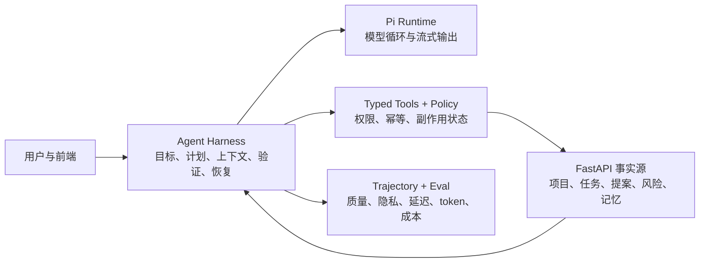

# ProjectFlow Agent 优化与强化说明

> 适用场景：线下活动讲解、技术评审与数据答辩
>
> 证据截止日期：2026-07-13
>
> 范围：T41 Agent Runtime、T42 ProjectMemory、T43 Agent Harness V2、T44 效率与模型配置、T45 私人多会话历史

## 1. 一页结论

ProjectFlow 的核心不是“让大模型生成一段项目管理文案”，而是让 Agent 在真实项目状态上持续完成一条可控闭环：理解目标、读取事实、提出计划、生成可审核草案、等待人类确认、跟踪执行、识别风险，并在失败或中断后继续工作。

这轮强化没有简单更换更大的模型，而是从五个基本问题入手：

1. **Agent 是否知道自己要完成什么？** 增加 Outcome Contract、RunPlan、WorkState 和确定性 Verifier。
2. **Agent 是否只能做被允许的事？** 使用 typed tools、effect ceiling、policy gate 和 Proposal-Confirm 划定权限。
3. **上下文是否准确且经济？** 去除重复输入，分离稳定 Prompt Kernel 与动态事实，按 token budget 压缩上下文。
4. **失败后能否安全继续？** 持久化 checkpoint、tool ledger、side-effect status，支持 resume、steering 和 fail-closed。
5. **优化是否有真实证据？** 建立公开 HTTP/SSE 场景评测、trajectory export、重复 production canary 和隐私门禁。

最终结果不是单一指标变好，而是质量、权限、成本、隐私和可恢复性同时形成闭环：

| 维度 | 当前结果 |
|---|---:|
| 后端测试 | 825 passed，4 skipped |
| Agent Bridge 测试 | 1142 passed，58 files |
| 前端测试 | 147 passed，17 files |
| Production canary | Flash/Pro 各 15 次隔离观测 |
| Routing / outcome / privacy / latency | 两模型均为 100% / 100% / 100% / 100% |
| 缓存命中率 | Flash 93.01%；Pro 93.51% |
| 平均未缓存输入变化 | Flash -85.2%；Pro -77.2% |
| 平均模型调用成本变化 | Flash -68.5%；Pro -58.8% |
| ProjectMemory 检索 | Recall@10 100%；MRR@10 0.97 |
| ProjectMemory 隐私检查 | 修复后 140 次正式调用中原始 ID 泄漏为 0 |

当前模型策略保持克制：**Flash 是默认模型，Pro 是用户显式选择的质量升级，不把同一供应商的 Pro 当作故障自动回退。**

## 2. 3–5 分钟现场讲解稿

### 2.1 我们遇到的问题

早期 ProjectFlow 已经可以调用模型生成方向、阶段计划、任务拆解和风险建议，但“会调用模型”不等于“Agent 足够可靠”。继续堆 Prompt 或工具会产生五类问题：

- 当前消息和历史消息可能重复进入上下文，浪费 token，也会让模型误以为用户重复强调同一句话。
- 工具越来越多后，模型可能调用超出当前 Skill 权限的工具。
- 运行中断后，如果不知道某个写工具是否已经成功，就不能安全重试。
- 模型输出看起来正确，不代表引用了真实项目事实，也不代表没有暴露内部 ID 或私人记忆。
- 单次演示成功无法回答“是否稳定、成本多少、缓存是否有效、换模型是否更好”。

### 2.2 我们怎么做

我们没有先换模型，而是把 Agent 拆成四层：



- **FastAPI 保管业务事实**：模型不能直接改项目方向、任务负责人、日期或状态。
- **Pi Runtime 负责模型循环**：支持多模型，但不拥有数据库事实。
- **Harness 负责可靠执行**：先定义成功标准，再计划、行动、观察、验证；每次工具边界都可 checkpoint。
- **评测系统负责证明结果**：从真实公开流式入口运行固定场景，而不是只测试内部函数。

### 2.3 为什么这不是普通聊天机器人

普通聊天机器人主要回答“说什么”；ProjectFlow Agent 还必须回答：

- 这次请求是回答问题、澄清需求，还是执行项目动作？
- 需要哪些项目事实和记忆？哪些私人信息不能进入共享会话？
- 当前 Skill 允许调用哪些工具？这些工具会产生什么副作用？
- 模型声称完成后，是否真的存在对应的工具证据或待确认提案？
- 运行被取消、超时或重启后，哪些步骤可以重放，哪些必须人工核对？

### 2.4 效果如何

在相同的五类生产场景中，我们分别对 DeepSeek Flash 和 Pro 做了三次重复观测，共 30 个隔离 observation。两模型的 routing、outcome、privacy 和各场景 latency gate 全部通过。

更重要的是，我们没有只看“缓存率”：

- Flash 平均未缓存输入从 18,794 降到 2,787 token，下降 85.2%。
- Pro 平均未缓存输入从 19,513 降到 4,459 token，下降 77.2%。
- Flash 平均成本下降 68.5%，Pro 下降 58.8%。
- 平均输出量基本不变，Flash +0.3%，Pro +2.9%，说明节省主要来自输入去重和上下文优化，而不是简单让模型少回答。
- 跨场景 P95 延迟没有优于旧单次基线，但所有场景仍在预先冻结的门槛内；因此我们不宣称“所有延迟都变快”。

## 3. 优化前后的关键数据

### 3.1 T44 Production Canary

测试场景包括：普通回答、项目状态读取、风险与重规划、阶段规划、分工与隐私。每个模型、每个场景重复三次，每次重新 seed 独立数据库状态并创建新的私人会话，避免上一轮产生的风险、提案或历史污染下一轮。

| 指标 | DeepSeek Flash | DeepSeek Pro |
|---|---:|---:|
| Observation 数量 | 15 | 15 |
| Routing / outcome / privacy / latency | 100% / 100% / 100% / 100% | 100% / 100% / 100% / 100% |
| 平均延迟 | 20.971s | 51.449s |
| 跨场景 P95 延迟 | 38.384s | 99.294s |
| 未缓存输入总量 | 41,802 | 66,880 |
| 输出 token 总量 | 31,174 | 45,969 |
| Cache-read token | 556,416 | 964,224 |
| 缓存命中率 | 93.01% | 93.51% |
| 最终组合证据成本 | $0.0161389648 | $0.0725811420 |
| 平均每次 observation 成本 | $0.0010759310 | $0.0048387428 |

延迟门槛在测试前冻结：普通回答 30 秒，状态/规划/隐私 90 秒，风险重规划 120 秒。不能在看到结果后再放宽门槛。

### 3.2 可比口径下的前后变化

旧基线每个场景只有一次观测，新证据每个场景有三次，所以不能直接比较 token 总量。我们使用“每次 observation 平均值”进行归一化比较。

| 指标 | Flash：优化前 → 优化后 | Pro：优化前 → 优化后 |
|---|---:|---:|
| 未缓存输入 / observation | 18,794 → 2,787（-85.2%） | 19,513 → 4,459（-77.2%） |
| 成本 / observation | $0.00341294 → $0.00107593（-68.5%） | $0.01174582 → $0.00483874（-58.8%） |
| 输出 / observation | 2,072 → 2,078（+0.3%） | 2,977 → 3,065（+2.9%） |
| 跨场景 P95 | 32.655s → 38.384s（+17.5%） | 92.711s → 99.294s（+7.1%） |

这里保留了一个“不好看但真实”的结果：重复测试下的跨场景 P95 高于旧单次基线。它说明成本和输入显著改善，但不能据此声称所有延迟都下降。

### 3.3 ProjectMemory 证据

ProjectMemory 不是把完整聊天记录塞回 Prompt，而是从方向确认、提案拒绝、分工确认和重规划等业务事件中确定性提取治理信息，并带有来源、可见性、有效期、状态和 supersede 关系。

| 指标 | 结果 |
|---|---:|
| 固定检索评测 | 50 个中文分层查询，覆盖 8 类检索难度 |
| Recall@10 / Recall@3 | 100% / 100% |
| MRR@10 | 0.97 |
| 错误结果排第一比例 | 2% |
| Fixture 最大检索延迟 | 10.60ms |
| 正式 A/B Pilot | 初始 300 次调用 / 150 对 |
| 修复后原始 ID 泄漏 | 0 / 140 次正式调用 |
| 综合门禁 | 7 / 7 通过 |

这些指标证明的是固定 fixture 和场景下的检索、可见性与输出守卫表现，不等于所有开放式问题都能 100% 找到最佳记忆。

## 4. 我们具体强化了什么

### 4.1 从单次模型调用升级为 Agent Harness

每次请求先经过共享 request preparation，形成紧凑的 Outcome Contract：请求类型、目标、成功标准和允许的 effect ceiling。行动型请求再生成持久化 RunPlan 和 WorkState。

模型停止生成并不代表任务完成。Verifier 会检查：

- 是否满足 Outcome Contract；
- 是否有必要的工具证据；
- 是否产生了正确类型的提案或 advisory record；
- 是否违反隐私、权限或业务不变量；
- 是否需要继续执行、降级、等待用户或失败关闭。

### 4.2 Prompt Kernel 与上下文工程

我们把 Prompt 分为稳定前缀和动态后缀：

- 稳定部分：Agent 身份、领域规则、Proposal-Confirm、Skill 工作流、工具契约。
- 动态部分：当前时间、ID 到显示名称映射、ProjectMemory、WorkspaceState、会话历史和当前请求。

具体优化包括：

- 当前用户输入只出现一次，并从 recent history 中排除。
- 只有需要时间推理的任务才注入当前时间。
- answer mode 不注入完整行动计划；action mode 才注入 Outcome Contract 和当前步骤。
- Context Ledger 记录每个 block 的版本、hash、token 预算、采用/丢弃原因。
- required block 放不下时进入明确的 degraded/blocked 状态，不静默删除安全规则。

### 4.3 Pi 模型配置与真实归因

模型配置从“能填一个 model name”强化为可验证注册表：

- 始终且只能存在一个有效默认模型。
- 用户显式选择无效模型时直接报错，不静默替换。
- requested model、resolved model 和 fallback reason 分开记录。
- 普通对话和复杂 action 都会传递用户选择的模型与受支持的 thinking level。
- 配置能力尽量对照 Pi provider catalog，而不是完全相信手写字段。

缓存计算也按 Pi 的真实语义修正：`usage.input` 已经是未缓存输入，缓存率应为：

```text
cacheRead / (input + cacheRead + cacheWrite)
```

如果再次从 `input` 中减去 `cacheRead`，就会重复扣减并得到错误结论。此前“缓存率偏低”的主要问题正是统计口径错误，而不是 provider 缓存没有工作。

### 4.4 Typed Tools 与权限边界

Agent 只能调用窄而明确的 ProjectFlow 工具，不能直接操作数据库，也没有 shell、任意文件写入或开放网络权限。

工具 manifest 会声明：

- input/output schema；
- read-only、proposal create 或 advisory write；
- timeout、retry、并发组和幂等要求；
- 隐私等级、resume policy 和 side-effect status；
- 是否允许被模型调用。

高影响事实变更必须先生成 Reviewable Draft，例如方向卡、阶段计划、任务拆解、分工或重规划提案，再由人类通过公开 API 确认。模型不能直接修改最终负责人、任务状态、项目方向和日期。

### 4.5 Skills V2 不只是 Prompt 模板

Skills V2 同时约束意图、步骤、工具和权限。多个 Skill 组合时使用最严格的 effect ceiling，且这一结果会贯穿：

- Outcome Contract；
- Prompt 与 trace metadata；
- 暴露给模型的工具 manifest；
- 调用前 policy gate；
- 执行后的 verifier。

这避免了“Prompt 说只读，但工具列表仍然暴露写工具”的伪安全。写工具保持串行；只有所有实际调用都声明为安全只读时才允许并发。

### 4.6 Durable Run、恢复与用户协作

AgentRun、checkpoint、RunPlan、WorkState、ToolLedger 和关键事件持久化在 FastAPI/SQLite 中。运行被取消、断连或 sidecar 重启后，可以根据 checkpoint 重新装载，而不是完全依赖内存会话。

恢复遵循三个原则：

1. 已知无副作用的读取可以安全重试。
2. 有幂等键且结果已确认的写入不能重复创建。
3. side-effect status 为 `unknown` 时禁止自动 fallback，必须 reconciliation 或人工处理。

用户还可以在运行中 steering：追加约束、修改计划、回答澄清或取消任务，而不是只能等待模型结束。

### 4.7 ProjectMemory：保存项目治理事实，而不是无限堆聊天

ProjectMemory 只从定义明确的业务事件确定性抽取，不调用模型生成 V1 记忆。检索前后都执行 project、workspace、viewer、visibility、status 和 valid-until 过滤。

它与普通会话历史分开：

- 会话历史保存交互上下文；
- ProjectMemory 保存可追踪的治理信息；
- AgentRunState 保存执行控制状态；
- Primary Project State 仍由 FastAPI 业务模型拥有。

### 4.8 私人多会话历史

每个项目可以新建多个 Agent 会话，并从历史列表重新进入。新会话默认属于创建者且为 private；旧的单例会话迁移为明确标记的 team history。

隐私不是靠关键词过滤，而是在数据源处控制：

- 所有 list/create/read/message/stream 路径验证 viewer 和项目成员身份。
- 项目 owner 不能仅凭 owner 身份读取其他成员的私人会话。
- team conversation 只允许注入 team-visible ProjectMemory。
- 切换项目或会话时重新校验 URL 中的 conversation。
- 流式输出期间禁止切换，避免回复写入错误会话。
- GET 不创建数据，新对话在首条消息发送时才落库。

## 5. 我们如何保证数据可信

### 5.1 使用真实公开入口

Production canary 通过与前端相同的公开 HTTP/SSE 运行入口执行，而不是直接调用某个内部函数。评测同时观察流式事件、持久化 run/message、实际模型、工具证据、最终输出和 usage telemetry。

### 5.2 每次观测隔离

每个 observation 都重新 reset/seed 专用临时 SQLite 后端、读取新的 workspace state，并创建新的 private conversation。主模型、对比模型和重复次数顺序执行，避免 effectful 场景并发污染状态。

### 5.3 区分缺失值和零

Provider 没有返回 reasoning 或 cache-write 时，指标必须标记 unavailable；只有 provider 明确返回 0 才记录 0。报告还记录 metric coverage，避免“采集不到”被误写成“没有消耗”。

### 5.4 失败样本不能偷偷删除

第一次完整 post-T44 canary 中，Pro 风险重规划出现 141.206 秒 outlier，超过 120 秒门槛。我们没有删除整次结果，而是定位到工具把已持久化的完整分析再次回传给模型，触发大型结果分页和额外模型轮次。

修复后只重跑受影响的 risk-replan 场景，并保留其他 24 个未受影响 observation：

| Pro risk-replan 指标 | 修复前 | 修复后 | 变化 |
|---|---:|---:|---:|
| 平均延迟 | 110.611s | 88.730s | -19.8% |
| P95 延迟 | 141.206s | 99.294s | -29.7% |
| 平均未缓存输入 | 7,735 | 5,301 | -31.5% |
| 平均成本 | $0.00992461 | $0.00858474 | -13.5% |

这次修复没有删掉 AgentEvent 中的完整分析，只是不再把同一内容重复塞回模型工具结果。

## 6. 对抗性审查与当前边界

### 可以得出的结论

- 固定场景下，T44 后的平均未缓存输入和测得成本显著下降。
- 两个生产模型在 30 个隔离 observation 中都满足预先冻结的 outcome、privacy 和场景延迟门槛。
- Prompt 去重、稳定前缀和上下文预算没有通过压缩输出长度来换取成本下降。
- Proposal-Confirm、typed tool 和 effect ceiling 能阻止模型直接提交高影响主事实。
- 私人会话和 ProjectMemory 可见性在数据源与 API 层执行，而不是只依赖生成后过滤。

### 不能过度推导的结论

- 30 个 observation 不能证明所有真实项目请求都 100% 成功。
- 93% 缓存命中率是这组 Prompt、provider 和场景下的结果，不是永久保证。
- Provider 的价格、延迟和缓存策略可能变化，2026-07-13 的数字不是长期 SLA。
- 跨场景 P95 没有比旧单次基线更低，所以不能笼统宣称“整体延迟下降”。
- `constraint_respected` 当前证明模型提交了成员约束检查证据，不证明自然语言约束在语义上一定被正确理解。
- ProjectMemory 的 100% recall 来自固定 fixture，不代表开放世界检索永远正确。

### 下一步最值得做的两项强化

1. 把成员可用时间、不可承担任务等自然语言限制升级为结构化约束，再进行确定性匹配。
2. 提供更紧凑的 workspace read view，减少复杂风险场景读取大型 WorkspaceState 后触发分页的概率。

## 7. 建议的现场演示

### 演示一：从项目状态到可审核计划

1. 进入一个已有项目。
2. 询问“现在最需要推进什么？”展示 Agent 读取真实状态。
3. 让 Agent 生成阶段计划或任务拆解。
4. 展示它只生成 pending proposal，必须由人确认后才进入项目主状态。

评委看到的重点：Agent 不是直接改数据库，而是“读取事实 → 解释依据 → 生成草案 → 人类确认”。

### 演示二：风险识别与安全重规划

1. 提交一次延期或阻塞 check-in。
2. 让 Agent 分析风险并生成 Risk/ActionCard。
3. 如果建议改变任务、阶段、负责人或日期，展示它转入 replan proposal，而不是直接修改。
4. 展示运行轨迹中的 tool evidence、side-effect status 和 verifier 结果。

评委看到的重点：风险记录可以直接形成 advisory record，但高影响缓解措施仍受 Proposal-Confirm 控制。

### 演示三：新会话、历史会话与隐私

1. 新建一个私人会话并发送问题。
2. 切换到另一个历史会话，展示上下文互不混入。
3. 切换成员，验证不能读取其他成员的 private conversation。
4. 展示团队历史只能使用 team-visible ProjectMemory。

评委看到的重点：多会话既降低无关上下文成本，也解决了共享聊天可能间接泄露私人记忆的问题。

## 8. 评委常见问题速答

### 为什么不用更强模型直接解决？

更强模型不能自动解决权限、幂等、恢复、隐私和可验证性。我们先建立 Harness 和工具边界，再用模型做适合模型的理解与生成工作。

### Agent 能不能直接改任务？

不能直接提交高影响主事实。它可以生成 proposal 或 advisory record；方向、阶段计划、任务负责人、日期等最终变更必须经过现有业务确认路径。

### 缓存率为什么能到 93%？

稳定规则和工具契约放在 Prompt 前缀，动态事实放在后缀；当前消息只出现一次。缓存率按 Pi 的 `input/cacheRead/cacheWrite` 真实口径计算，而不是估算。

### 为什么还保留 Flash？

两模型 outcome/privacy 都通过，但 Pro 平均每次 observation 成本约为 Flash 的 4.5 倍，延迟也更高。当前没有证据支持把所有请求默认升级到 Pro。

### 如何避免 Agent 编造项目成员或任务？

模型使用 typed tools 读取真实 WorkspaceState；输出经过 schema、引用合法性和 verifier 检查。用户可见内容使用 display name 和任务标题，不直接显示原始 ID。

### 如何避免“测试是为了通过测试而写的”？

核心 operational eval 走公开 HTTP/SSE seam，使用真实模型、真实持久化和工具调用；固定场景同时检查路由、结果、隐私、延迟、token 和成本。确定性单元测试负责守住回归，两类证据分工不同。

## 9. 技术证据索引

| 主题 | 仓库证据 |
|---|---|
| Agent Runtime 总体架构 | [`../T41/ProjectFlow_Agent_Runtime_Team_TDD.md`](../T41/ProjectFlow_Agent_Runtime_Team_TDD.md) |
| Runtime、状态、恢复与边界 | [`../T41/ProjectFlow_Agent_Runtime_Foundation_Design.md`](../T41/ProjectFlow_Agent_Runtime_Foundation_Design.md) |
| Tools、Skills 与 Proposal-Confirm | [`../T41/ProjectFlow_Agent_Tools_Skills_Design.md`](../T41/ProjectFlow_Agent_Tools_Skills_Design.md) |
| ProjectMemory 设计与最终证据 | [`../T42/project-memory-v1-closure.md`](../T42/project-memory-v1-closure.md) |
| Agent Harness V2 规格 | [`../T43/ProjectFlow_Agent_Capability_Maturity_Spec.md`](../T43/ProjectFlow_Agent_Capability_Maturity_Spec.md) |
| T44 效率与模型配置规格 | [`../T44/agent-efficiency-model-config-spec.md`](../T44/agent-efficiency-model-config-spec.md) |
| T44 重复生产 canary | [`../T44/post-t44-production-canary-2026-07-13.md`](../T44/post-t44-production-canary-2026-07-13.md) |
| T45 私人多会话历史 | [`../T45/agent-conversation-history-spec.md`](../T45/agent-conversation-history-spec.md) |
| API 契约 | [`../api-contract.md`](../api-contract.md) |
| 运维与复现命令 | [`../runbook.md`](../runbook.md) |
| 当前交接与测试基线 | [`../handoff.md`](../handoff.md) |

## 10. 关键实现提交

| Commit | 说明 |
|---|---|
| `d2c92f3` | Agent Harness V2 control plane |
| `11d2517` | 运行控制、公开场景评测与 trajectory |
| `e3c842d` | Harness 缺口修复与事件放大治理 |
| `e8bd6e0` | 当前输入去重与 cache telemetry |
| `22b7977` | 模型配置、选择和真实归因 |
| `70bcb99` | Prompt Kernel 2.0 与 Context receipts |
| `6ae1831` | Skill effect ceiling 与成员约束证据 |
| `6027885` | 私人多会话后端与隐私迁移 |
| `435f489` | 会话历史前端与 URL/流式安全 |
| `299c6b9` | 可重复、隔离的 production canary |
| `bf5ebab` | Pi cache usage 语义修正 |
| `1d12236` | 风险工具结果压缩与额外模型轮次消除 |

## 11. 复现验证

```bash
# Backend
cd backend
.venv/bin/python -m pytest app/tests/ -q
.venv/bin/python -m ruff check app

# Agent Bridge
cd ../agent-bridge
../scripts/npm test
../scripts/npm run typecheck
../scripts/npm run build

# Frontend
cd ../frontend
../scripts/npm test
../scripts/npm run lint
../scripts/npm run build
../scripts/npm audit --omit=dev
```

Production canary 的环境变量、隔离规则和运行方式见 [`../runbook.md`](../runbook.md)。API key、内部 service token、原始私人会话和本地 SQLite 数据不进入报告或 Git。
